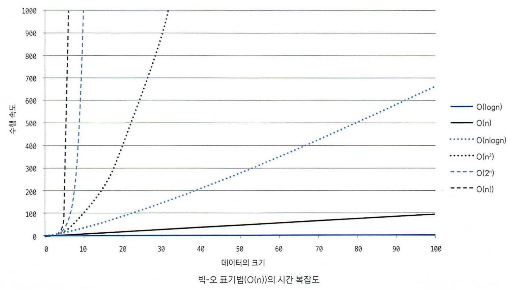

# 01 어떤 알고리즘으로 풀어야 할까?
## 01-1 시간 복잡도 표기법 알아보기

코딩테스트에서는 빅-오표기법 O(n)으로 수행 시간을 계산하는게 좋다.

# 자료구조

## 03-1 배열과 리스트

### 배열

- 연속된 메모리에 값이 채워져 있는 형태
- 인덱스로 값에 바로 접근 가능
- 값 삽입 삭제가 어려움
- 구조가 간단해서 코테에서 많이 사용

### 리스트

- 노드를 연결한 자료구조
- 값에 접근하려면 처음부터 순서대로 접근 해야함
- 포인터로 연결되어 있어 데이터 삽입 삭제 연산속도가 빠름
- 크기가 정해져 있지 않아 크기가 유동적
- 배열보다 구조가 복잡

## 03-2 구간 합

### 구간 합의 핵심 이론

구간 합 알고리즘을 활용하려면 합 배열 먼저 구해야 한다.

합 배열 S를 만드는 공식

`S[i] = S[i-1] + A[i]`

구간 합을 구하는 공식

`S[j] - S[i-1]` // i~j까지 구간 합

