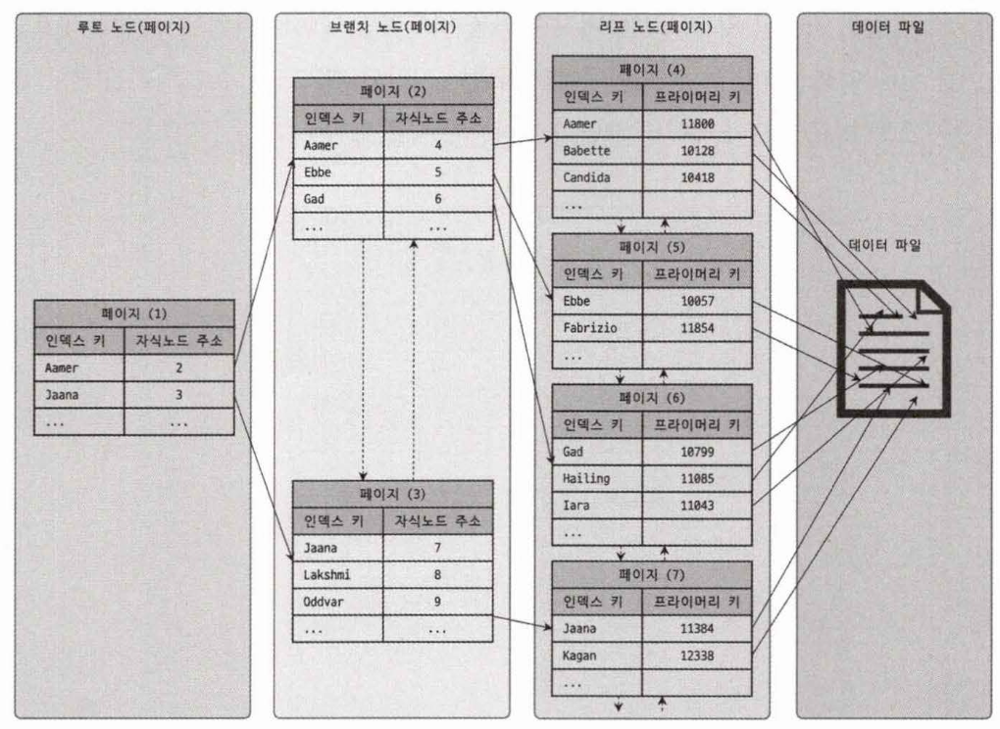

## 클러스터링 인덱스

### 클러스터링 인덱스

클러스터링 인덱스(클러스터링 키)는 테이블의 PK라고 할 수 있다.

프라이머리 키 값에 의해 레코드의 저장 위치가 결정된다. PK 값이 변경된다면 레코드의 물리적인 저장 위치가 바뀐다.


```sql
UPDATE tb_test SET emp_no = 100002 WHERE emp_no = 100007;
```


PK 기반의 검색은 매우 빠르다.

하지만 레코드의 저장이나 PK의 변경이 상대적으로 느리다.

### PK를 설정하지 않은 경우

기본적으로 PK를 클러스터링 키로 선택되지만 PK가 없는 테이블도 클러스터링 키는 존재하는데 다음 우선순위로 지정한다.

1. `NOT NULL` 옵션의 유니크 인덱스 중에서 첫 번째 인덱스를 클러스터링 키로 지정
2. 테이블 내부적으로 자동으로 유니크한 값을 가지도록 증가되는 컬럼을 추가하고 클러스터링 키로 지정

1,2번과 같이 자동으로 추가되는 경우 사용자에게 노출되지 않으며 쿼리 문에서도 명시적으로 사용할 수 없다.

PK 설정하지 않고 조회를 하게되면 `Table Full Scan`이 발생한다.

즉, 아무런 성능적인 이점이 없으므로 PK를 명시적으로 생성하는게 좋다.

## 클러스터링 인덱스의 장단점

간단히 말하면 장점은 빠른 읽기 단점은 느린 쓰기다.

보통 웹 서비스에서 읽기와 쓰기의 비율이 9:1, 8:2 라서 조금 느린 쓰기를 감수하고 읽기를 빠르게 유지하는 것이 좋다.

## 세컨더리 인덱스

InnoDB 테이블의 모든 세컨더리 인덱스는 해당 레코드가 저장된 주소가 아니라 PK값을 저장한다.



세컨더리 인덱스로 조회가 발생하면 인덱스로 PK값을 찾고 클러스터링 인덱스인 PK로 최종 레코드를 찾는다.

- 인덱스로 검색한다.
- 인덱스에 키가 있고 밸류에 PK가 들어있다.
- 인덱스를 통해서 PK를 찾고 PK로 해당 로우를 찾는다.
- 모든 데이터는 PK를 통해서만 찾을 수 있다.

