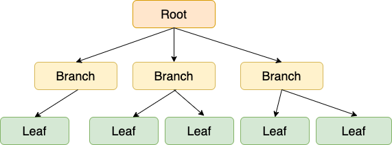
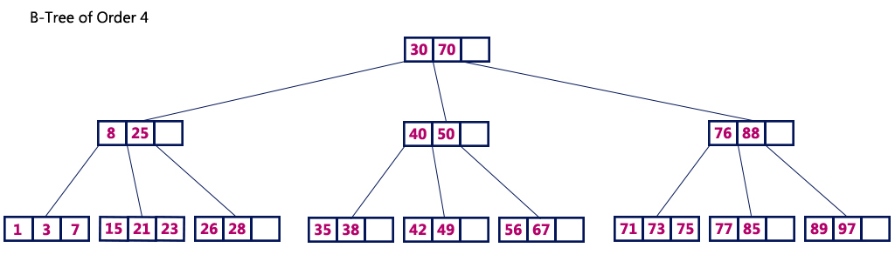

# Index

## 인덱스란?

데이터베이스 테이블에 대한 검색 성능을 향상시켜주는 자료 구조

DBMS의 인덱스의 자료구조는 `SortedList`이며, 데이터 저장은 `ArrayList`를 사용

## `ArrayList` vs `SortedList`

### `ArrayList`

- 데이터 파일이 사용하는 자료구조
- 값을 저장되는 순서대로 유지

### `SortedList`

- 인덱스가 사용하는 자료 구조
- 저장되는 값을 항상 정렬된 상태로 유지
- 저장할 때마다 항상 값을 정렬해서 과정이 복잡하고 느림
- 정렬되어 있어 아주 빨리 원하는 값을 찾을 수 있음
- 인덱스가 많은 테이블은 `INSERT`, `UPDATE`, `DELETE`가 느리지만 `SELECT`는 빠름

## B-tree

- Balanced Tree로 좌우 균형을 맞춘 트리
- 검색/삽입/삭제 모두 O(logN)






## B+tree

- B-tree와 다르게 브랜치 노드에 데이터를 저장하지 않고 리프 노드에만 데이트를 저장
- 같은 레벨의 노드끼리는 Double Linked List 구조로 연결되어 있고 부모자식 연결구조는 Single Linked List로 연결되어 있다.
- Range 탐색의 경우 같은 레벨의 노드끼리 연결되어 있기 때문에 상위 레벨을 탐색할 필요가 없다.


## 인덱스의 키 값의 크기

InnoDB 디스크에 데이터를 저장하는 가장 기본 단위를 페이지라고 하며, 인덱스 역시 페이지 단위로 관리 됩니다.

페이지는 16KB 로 크기가 고정되어 있습니다. (설정 변경 가능)

인덱스 키의 크기가 16Byte 이고 자식노드의 주소가 담긴 크기가 12Byte 라고 했을 때 한 페이지에 저장되는 갯수

`16*1024 / (16+12) = 585` 585개 

인덱스의 키의 크기가 32Byte 이고 자식노드의 주소가 담긴 크기가 12Byte 라고 했을 때 한 페이지에 저장되는 갯수

`16*1024 / (32+12) = 372` 372개

500개의 row를 읽을 때 인덱스 키의 크기가 16Byte 의 경우 1개의 페이지에서 조회가 끝나지만 32Byte 라면 2개의 페이지에서 조회가 필요

결론적으로 인덱스 키의 크기가 작을수록 성능에 좋다.

## 인덱스 컬럼 선정 기준

1. 조건절에서 자주 사용하는 컬럼
2. 카디널리티가 높은 컬럼 (카디널리티 == 중복도)
3. 수정빈도가 낮은 컬럼
4. 선택도가 낮은 컬럼
5. 여러 컬럼을 인덱스로 설정할 경우 카디널리티가 높은 것부터 지정하는 것이 성능에 좋다.

## 인덱스 성능 테스트

```sql
explain
select *
from tb_order
where order_name = '토피넛라떼';

+----+-------------+----------+------------+------+---------------+------+---------+------+------+----------+-------------+
| id | select_type | table    | partitions | type | possible_keys | key  | key_len | ref  | rows | filtered | Extra       |
+----+-------------+----------+------------+------+---------------+------+---------+------+------+----------+-------------+
|  1 | SIMPLE      | tb_order | NULL       | ALL  | NULL          | NULL | NULL    | NULL |    6 |    16.67 | Using where |
+----+-------------+----------+------------+------+---------------+------+---------+------+------+----------+-------------+
```

```sql
create index tb_order_idx01 on `tb_order` (order_name);

explain
select *
from tb_order
where order_name = '토피넛라떼';

+----+-------------+----------+------------+------+----------------+----------------+---------+-------+------+----------+-------+
| id | select_type | table    | partitions | type | possible_keys  | key            | key_len | ref   | rows | filtered | Extra |
+----+-------------+----------+------------+------+----------------+----------------+---------+-------+------+----------+-------+
|  1 | SIMPLE      | tb_order | NULL       | ref  | tb_order_idx01 | tb_order_idx01 | 122     | const |    1 |      100 | NULL  |
+----+-------------+----------+------------+------+----------------+----------------+---------+-------+------+----------+-------+
```

| type  | 설명                                                                                                                              |
|-------|---------------------------------------------------------------------------------------------------------------------------------|
| const | 기본 키 또는 고유키에 의한 loockup(등가비교), 조인이 아닌 가장 외부의 테이블에 접근 하는 방식, 결과는 항상 1행이다. 단 기본 키, 고유 키를 사용하고 있으므로 범위 검색으로 지정하는 경우 const가 되지 않는다. |
| ALL   | 전체 행 스캔, 테이블의 데이터 전체에 접근한다.                                                                                                     |
| ref   | 고유 키가아닌 인덱스에 대한 등가비교, 여러 개 행에 접근할 가능성이 있다.                                                                                      |
| range | 인덱스 특정 범위의 행에 접근한다                                                                                                              |                                                                                                              
| ...   | ...                                                                                                                             |

인덱스를 걸지 않았을 경우에는 Table Full Scan으로 조회를 하는 반면에, 인덱스를 걸었을 경우 ref 타입으로 인덱스를 사용하여 조회하는 것을 알 수 있다.
