# RealMySQL 8.0 1권

# 01 소개

## 1.2 왜 MySQL인가?
자기가 가장 잘 활용할 수 있는 DBMS가 가장 좋은 DBMS이다.
- 안정성
- 성능과 기능
- 커뮤니티나 인지도

# 02 설치와 설정

### 2.1 MySQL 서버 설치

해당 내용은 책 내용과 다르게 Docker에 설치하는 과정이다.

간편한 `docker-compose`를 사용하여 설치한다.

```yaml
#docker-compose.yml
version: '3'
services:
  db:
    platform: linux/amd64
    container_name: mysql-8.0.29-test1
    image: mysql:8.0.29-debian
    restart: always
    ports:
      - 3155:3306
    environment:
      MYSQL_ROOT_PASSWORD: example
      TZ: Asia/Seoul
```

`docker-compose.yml`이 작성된 경로에서 아래 명령을 실행한다.

```shell
$ docker-compose up -d
```

컨테이너가 잘 올라왔는지 확인한다.

```shell
$ docker ps

CONTAINER ID   IMAGE     COMMAND                  CREATED         STATUS         PORTS                               NAMES
e5594d6ff60a   mysql     "docker-entrypoint.s…"   8 minutes ago   Up 8 minutes   33060/tcp, 0.0.0.0:3155->3306/tcp   mysql-test
```

# 03 사용자 및 권한

## 계정 생성

5.7 까지는 `GRANT` 명령으로 권한의 부여와 동시에 계정 생성이 가능했다.

8.0 부터는 계정 생성은 `CREAT USER` 명령으로 권한 부여는 `GRANT` 명령으로 구분해서 실행하도록 바뀌었다.

계정 생성 시 옵션
- 계정의 인증 방식과 비밀번호
- 비밀번호 유효기간, 이력 개수, 재사용 불가 기간
- 기본 역할
- SSL 옵션
- 계정 잠금 여부

```sql
CREATE USER 'user'@'%'
IDENTIFIED WITH 'mysql_native_password' BY 'password' 
REQUIRE NONE
PASSWORD EXPIRE INTERVAL 30 DAY
ACCOUNUT UNLOCK
PASSWORD HISTORY DEFAULT 
PASSWORD REUSE INTERVAL DEFAULT
PASSWORD REQUIRE CURRENT DEFAULT;
```

### `IDENTIFIED WITH`

사용자의 인증 방식과 비밀번호 설정

`IDENTIFIED WITH` 뒤에는 반드시 인증 방식을 명시

서버의 기본 인증 방식을 사용하고자 한다면 `IDENTIFIED BY 'password'`형식으로 명시해야 한다.

기본 인증 방식은 `Caching SHA-2 Authentication`

### `REQUIRE`

MySQL 서버에 접속할 때 암호화된 SSL/TLS을 사용 여부 설정

### `PASSWORD EXPIRE`

비밀번호 유효기간을 설정

별도로 명시하지 않으면 DEFAULT 값으로 설정

- `PASSWORD EXPIRE` : 계정 생성과 동시에 비밀번호 만료 처리
- `PASSWORD EXPIRE NEVER` : 만료 기간 없음
- `PASSWORD EXPIRE DEFAULT` : default_password_lifetime 시스템 변수 값
- `PASSWORD EXPIRE INTERVAL n DAY` : 유효 기간을 오늘부터 n일자로 설정

### `PASSWORD HISTORY`

한번 사용했던 비밀번호를 재사용하지 못하게 설정

- `PASSWORD HISTORY DEFAULT` : password_history 시스템 변수 값
- `PASSWORD HISTORY n` : 비밀번호의 이력을 최근 n개 저장

### `PASSWORD REUSE INTERVAL`

한 번 사용한 비밀번호 재사용 금지 기간 설정

- `PASSWORD REUSE INTERVAL DEFAULT` : password_reuse_interval 변수 값 
- `PASSWORD REUSE INTERVAL n DAY` : n일 이후 비밀번호 재사용 가능

### `PASSWORD REQUIRE`

비밀번호 만료 후 새 비밀번호 변경할 때 기존 비밀번호 필요여부 옵션

- `PASSWORD REQUIRE CURRENT` : 비밀번호 변경 시 기존 비밀번호 필요
- `PASSWORD REQUIRE OPTIONAL` : 기존 비밀번호 불필요
- `PASSWORD REQUIRE DEFAULT` : password_require_current 시스템 변수 값

### `ACCOUNT LOCK / UNLOCK`

계정 생성/변경 시 계정 잠금 여부 설정

- `ACCOUNT LOCK` : 잠금
- `ACCOUNT UNLOCK` : 잠금 해제

## 권한 Privilege

5.7 버전의 권한은 정적 권한이라고 하며 8.0 부터는 동적 권한이 추가 됐다.

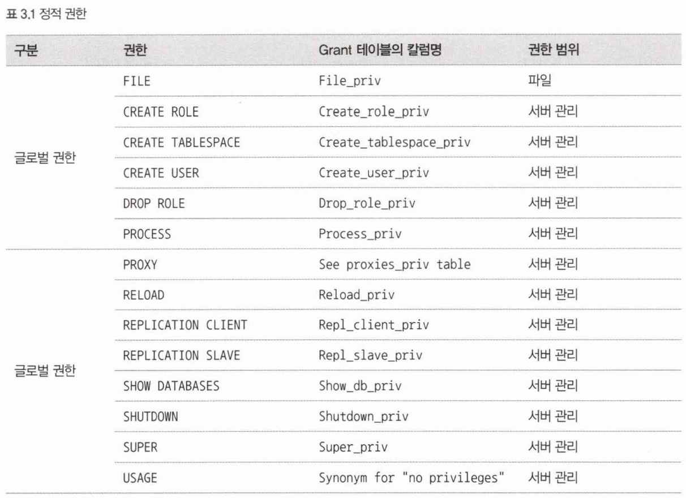
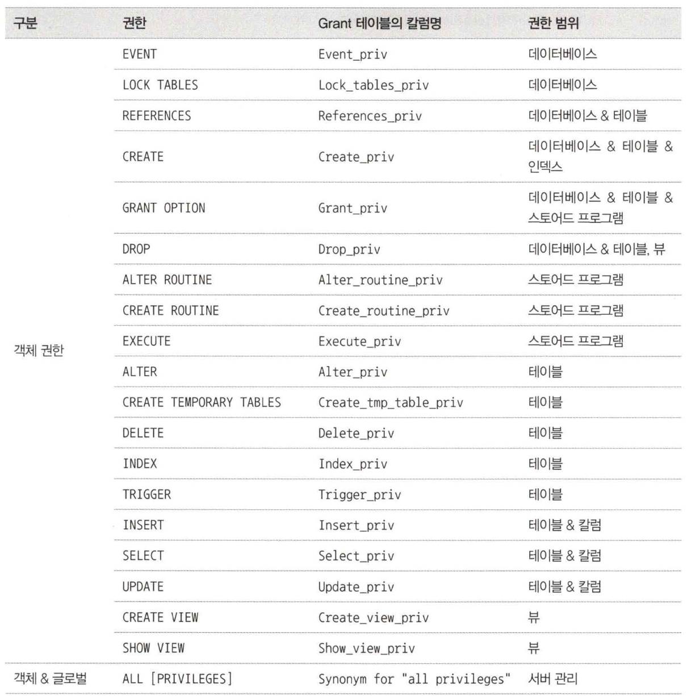
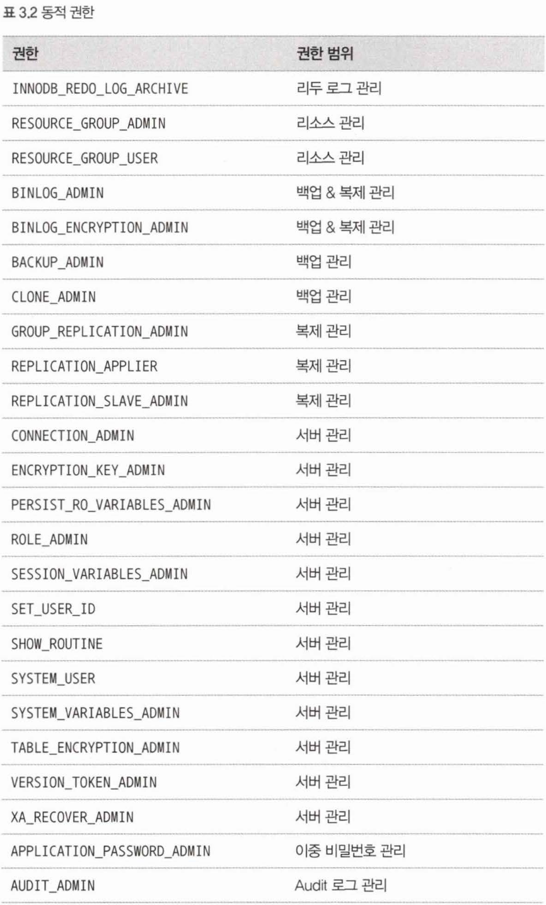


```sql
# 모든 DB에 권한 부여
GRANT SELECT, INSERT, UPDATE, DELETE ON *.* TO 'user'@'localhost';
# 특정 스키마에 권한 부여 
GRANT SELECT, INSERT, UPDATE, DELETE ON employees.* TO 'user'@'localhost';
# 특정 스키마의 테이블에 권한 부여
GRANT SELECT, INSERT, UPDATE, DELETE ON employees.department.* TO 'user'@'localhost';
# 특정 스키마의 테이블에 권한 부여 + 수정권한은 dept_name 컬럼만
GRANT SELECT, INSERT, UPDATE(dept_name) ON employees.department.* TO 'user'@'localhost';
```

# 04 아키텍처

## MySQL 엔진 아키텍처

쿼리를 작성하고 튜닝할 때 엔진의 구조를 알아야한다.

MySQL 서버는 다른 DBMS에 비해 구조가 상당히 독특하다.

독특한 구조 때문에 다른 DBMS에서는 가질 수 없는 엄청난 혜택이 있지만 다른 DBMS에서는 문제되지 않는 것들이 MySQL에서는 문제되기도 한다.

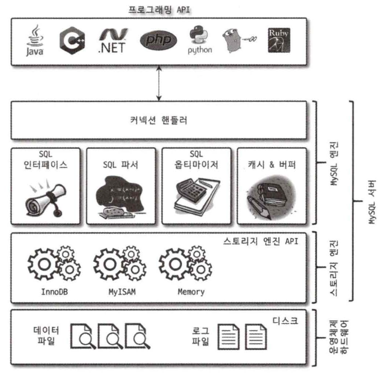

MySQL 서버는 크게 MySQL 엔진과 스토리지 엔진으로 구분할 수 있다.

### MySQL 엔진

클라이언트가 접속 및 쿼리 요청을 처리하는 커넥션 핸들러와 SQL 파서, 전처리기, 쿼리의 최적화된 실행을 위한 옵티마이저가 있다.

### 스토리지 엔진

실제 데이터를 디스크 스토리지에 READ, WRITE 하는 것은 스토리지 엔진이 한다.

MySQL 서버에서 MySQL엔진은 하나지만 스토리지 엔진은 여러 개를 동시에 사용할 수 있다.

### 핸들러 API

MySQL 엔진의 쿼리  실행기에서 데이트럴 읽고 쓸 때 각 스토리지 엔진에 쓰기 읽기를 요청하는데 이를 핸들러 요청이라고 한다.

### MySQL 스레딩 구조

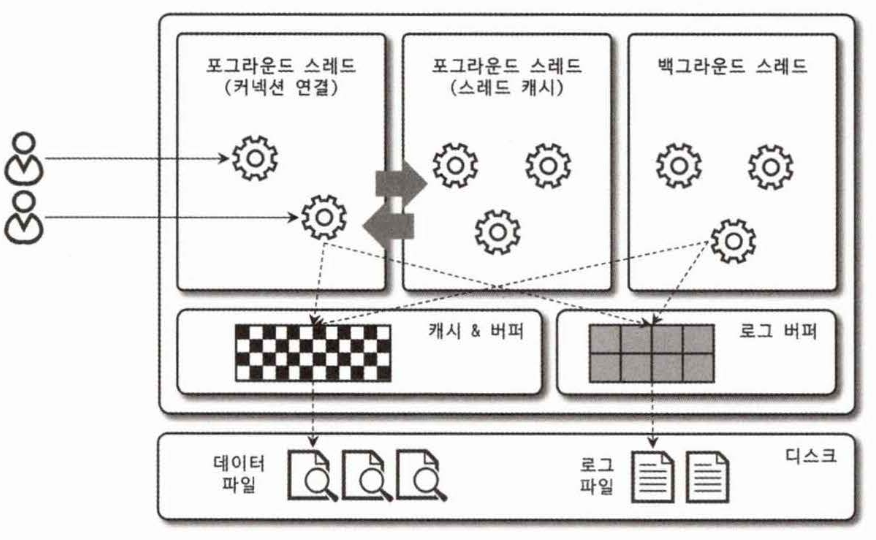

- MySQL 서버는 스레드 기반으로 작동
- 포그라운드와 백그라운드 스레드로 구분
- 실행 중인 스레드 목록 확인이 가능
    ```sql
    SELECT thread_id, name, type, processlist_user, processlist_host, FROM performance_schema.threds ORDER BY type, thred_id;
    ```
  
### 포그라운드 스레드 (클라이언트 스레드)

- 포그라운드 스레드는 MySQL 서버에 접속된 클라이언트의 수만큼 존재
- 각 클라이언트가 요청하는 쿼리 문장을 처리
- 커넥션을 종료하면 스레드 캐시로 돌아간다.
- 데이터를 데이터 버처나 캐시에서 가져오며, 버퍼나 캐시에 없는 경우 직접 디스크의 데이터나 인덱스 파일로부터 데이터를 읽어온다.
- InnoDB 테이블은 데이터 버퍼나 캐시까지는 포그라운드 스레드가 처리하고 나머지 버퍼로부터 디스크까지 기록은 백그라운드 스레드가 처리.

### 백그라운드 스레드

MyISAM은 해당사항이 없는 부분이지만 InnoDB는 여러 가지 작업을 백그라운드 스레드가 한다.

- Insert Buffer를 병합
- 로그를 디스크로 기록 
- InnoDB 버퍼 풀의 데이터를 디스크에 기록
- 데이터를 버퍼로 읽어 옴
- 잠금이나 데드락을 모니터링

가장 중요한 것은 로그스레드와 버퍼의 데이터를 디스크로 내려쓰는 작업을 하는 쓰기 스레드

### 트랜잭션 지원 메타데이터

데이터베이스 서버에서 테이블의 구조와 스토어드 프로그램 등의 정보를 메타데이터라고 하는데 5.7 버전까지는 테이블의 구조를 FRM 파일에 저장하여 관리했다.

파일 기반의 메타데이터는 생성 및 변경 작업이 트랜잭션을 지원하지 않기 때문에 테이블의 생성 또는 변경 중에 서버가 비정상적으로 종료되면 일관성이 깨지는 경우가 있었다.

8.0 버전부터는 이런 문제점을 해결하기 위해 테이블 구조 정보나 스토어드 프로그램을 InnoDB의 테이블에 저장하도록 개선했다.

### InnoDB 스토리지 엔진 아키텍처

InnoDB는 MySQL에서 사용할 수 있는 스토리지 엔진 중 유일하게 레코드 기반의 잠금을 제공하여 높은 동시성 처리가 가능하고 안정적이며 성능이 좋다.

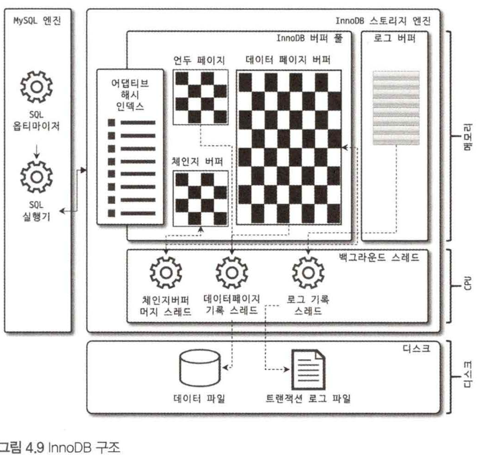

### 프라이머리 키에 의한 클러스터링

- InnoDB의 모든 테이블은 기본적으로 pk를 기준으로 클러스터링되어 저장.
- pk값의 순서대로 디스크에 저장
- 모든 세컨더리 인덱스는 레코드의 주소 대신 pk의 값을 논리적인 주소로 사용

### 외래 키 지원

- 외리 키는 InnoDB 스토리지 엔진 레벨에서 지원하는 기능
- MyISAM이나 MEMORY 테이블에서는 사용 불가
- 운영 환경에서는 외래 키를 권장하지 않는다.
- 외래 키 체크를 끄고 킬 수 있다.
  ```sql
  SET foreign_key_checks=OFF;
  SET foreign_key_checks=ON;
  ```

### MVCC (Multi Version Concurrency Control)

MVCC의 가장 큰 목적은 잠금을 사용하지 않고 일관된 읽기를 제공

트랜잭션 격리 레벨에 따라 동작이 달라진다.

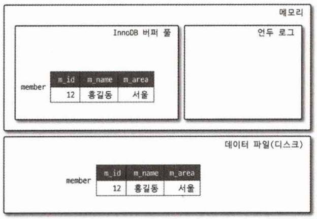

```sql
UPDATE member SET m_area='경기 WHERE' m_id=12;
```

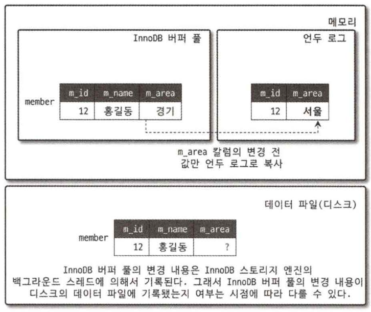

```sql
SELECT * FROM member WHERE m_id=12;
```

격리 수준이 `READ_UNCOMMITTED`인 경우 커밋이 됐거나 안됐거나 InnoDB 버퍼풀이나 데이터 파일로부터 변경되지 않은 데이터를 읽어서 반환한다.

`READ_COMMITTED` 이상의 격리 수준인 경우에는 커밋되기 전의 내용을 보관하고 있는 **언두영역의 데이터를 반환**한다.

### 잠금 없는 일관된 읽기 (Non-Locking Consistent READ)

`InnoDB 스토리지 엔진은`은 MVCC를 이용해 다른 트랙잭션이 가지고 있는 잠금을 기다리지 않고 읽기 작업이 가능

`READ UNCOMMITTED` `READ COMMITTED` `REPEATABLE READ`일 때 `INSERT`와 연결되지 않은 순수한 읽기 작업은 다른 트랜잭션과 관계없이 바로 실행된다.

즉 언두 영역의 데이터를 반환하여 `PHANTOM READ` 현상이 발생하지 않는다.

### 자동 데드락 감지

InnoDB 스토리지 엔진은 내부적으로 잠금이 데드락이 걸렸는지 잠금 대기 목록을 그래프 형태로 관리하여 체크한다.

InnoDB 스토리지 엔진은 데드락 감지 스레드를 가지고 있고 주기적으로 검사해 데드락이 걸린 트랜잭션들을 찾아서 하나를 강제 종료한다.

언두로그 양이 적은 트랜잭션을 종료시키는데 트랜잭션 강제 롤백으로 인한 부하가 적기 때문

### InnoDB 버퍼 풀

- InnoDB 스토리지 엔진에서 가장 핵심적인 부분이다. 
- 디스크의 데이터 파일이나 인덱스 정보를 메모리에 캐시하는 공간 
- 쓰기 작업을 지연시켜 일괄 작업으로 처리하는 버퍼 역할도 한다.
- 데이터를 변경하는 쿼리를 버퍼 풀에 모아서 처리하면 디스크 작업 횟수도 줄어든다.

### 버퍼 풀의 크기 설정

- 5.7 부터 풀 크기 조절 가능
- 운영체제 메모리 공간이 8GB 미만이면 50% 정도 설정
- 50GB 이상이면 15~30GB 설정
- 풀을 늘리는 작업은 시스템 영향도가 크지 않지만, 줄이는 작업은 매우 크다.
- 128MB 단위로 단위로 설정

~~중략..~~

# 05 트랜잭션과 잠금

트랜잭션이란?

- 작업의 완전성을 보장해 주는 것
- 하나의 논리적인 작업 셋에 모두 적용되거나 아무것도 적용되지 않아야 함을 보장해주는 것.

## 트랜잭션

### MySQL에서의 트랜잭션

InnoDB 테이블과 MyISAM 테이블 차이

```sql
INSERT INTO tab_myisam (fdpk) VALUES (3);
INSERT INTO tab_innodb (fdpk) VALUES (3);
```

```sql
INSERT INTO tab_myisam (fdpk) VALUES (1), (2), (3);
ERROR 162 (23300): Duplicate entry '3' for key 'PRIMARY'

INSERT INTO tab_innodb (fdpk) VALUES (1), (2), (3);
ERROR 162 (23300): Duplicate entry '3' for key 'PRIMARY'
```

```sql
SELECT * FROM tab_myisam;
+------+
| fdpk |
+------+
|     1|
|     2|
|     3|
+------+

SELECT * FROM tab_innodb;
+------+
| fdpk |
+------+
|     3|
+------+
```

InnoDB는 트랜잭션의 원칙대로 전 상태로 복구했지만, MyISAM은 부분 업데이트 현상이 발생했다.

## MySQL 엔진의 잠금

MySQL에서 사용되는 잠금은 스토리지 엔진 레벨과 MySQL 엔진 레벨로 나눌 수 있다.

MySQL 엔진 레벨의 잠금은 모든 스토리지 엔진에 영향을 미치지만, 스토리지 엔진 레벨의 잠금은 스토리지 엔진간 영향을 미치지 않는다.

MySQL 엔진 잠금 기능
- 테이블 락 : 테이블 데이터 동기화 잠금
- 메타데이터 락 : 데이터 구조를 잠그는 락
- 네임드 락 : 사용자의 필요에 맞게 사용하는 락

### 글로벌 락

- 잠금 중 가장 범위가 크고 다음 명령어로 획득할 수 있다.

  ```sql
  FLUSH TABLE WITH READ LOCK
  ```

- 한 세션에서 글로벌 락을 획득하면 다른 세선에서 SELECT를 제외한 모든 DDL, DML 등 변경 작업이 실행이 대기 상태로 남는다.
- MyISAM이나 MEMORY 테이블을 mysqldump로 일관된 백업을 할 때 사용한다.

**백업 락**

InnoDB는 트랜잭션을 지원하기 때문에 변경 작업을 멈출 필요가 없어졌고, 가벼운 글로벌 락이 필요해졌다.

8.0부터는 Xtrabackup이나 Enterprise Backup과 같은 백업 툴의 안정적인 실행을 위해 백업락이 도입 됐다.

```sql
LOCK INSTANCE FOR BACKUP;
UNLOCK INSTANCE;
```

백업 락은 모든 세션에서 다음 작업을 할 수 없다. (데이터 변경은 가능)
- DB 및 테이블 등 모든 객체 생성, 변경, 삭제
- REPAIR TABLE과 OPTIMIZE TABLE 명령
- 사용자 관리 및 비밀번호 변경

### 테이블 락

- 테이블 단위로 설정되는 잠금
- 명시적 또는 묵시적으로 테이블 락을 획득할 수 있다.

**명시적 락**

- `LOCK TABLE table_name [READ|WRITE]` 락 획득
- `UNLOCK TABLES` 잠금해제
- 애플리케이션에서 사용할 필요가 거의 없다.

**묵시적 락**

- MyISAM이나 MEMORY 테이블 데이터 변경 쿼리를 실행하면 발생

### 네임드 락

GET_LOCK() 함수를 이용해 임의의 문자열에 대해 잠금 설정할 수 있다.

여러 서버에서 DB 연동 시 동기화처리할 때 사용

### 메타데이터 락

DB 객체(테이블이나 뷰 등)의 이름, 구조를 변경하는 경우 획득하는 잠금

명시적으로 획득할 수 없고 `RENAME TABLE a TO b` 같이 테이블 변경할 때 자동으로 획득함

## InnoDB 스토리지 엔진 잠금

InnoDB 스토리지 엔진은 MySQL에서 제공하는 잠금과는 별개로 스토리지 엔진 내부에서 레코드 기반의 잠금 방식을 탑재하고 있다.

레코드 기반의 잠금 방식 때문에 MyISAM보다 동시성 처리가 뛰어나다.

하지만 이원화된 잠금 처리 탓에 MySQL 명령으로는 잠금 정보에 접근하기 까다로웠는데

**최근 버전에서는 트랜잭션 잠금, 잠금 대기 중인 트랜잭션 목록을 조회 및 종료할 수 있는 방법이 생겼다.**

- `information_schema`에 `INNODB_TRX`, `INNODB_LOCKS`, `INNODB_LOCK_WAITS`

InnoDB의 잠금 모니터링도 강화되면서 Performance Schema를 이용해 InnoDB 스토리지 엔진의 내부 잠금 모니터링 방법도 추가됐다.

### 레코드 락

- 레코드를 잠그는 락
- 다른 사용 DB와 동일한 역할
- 차이는 InnoDB 스토리지 엔진은 레코드 자체를 락 걸지 않고 인덱스의 레코드를 이용해 락 건다.
- 레코드 자체를 락거는 것과 인덱스를 잠그는 건 상당히 중요한 차이가 있다.
- InnoDB에서 대부분 보조 인덱스를 이용한 변경 작업은 `넥스트 키 락` 또는 `갭 락`을 사용하지만 pk 또는 유니크 인덱스에 의한 변경 작업은 레코드 자체에 락을 건다.

### 갭 락

- 갭락은 레코드를 락 거는게 아니라 레코드와 바로 인접한 레코드 사이의 간격을 락 거는 것
- 간격 사이에 새 레코드 생성을 제어하기 위함
- 자체적으로 사용되진 않고 `넥스트 키 락`의 일부로 자주 사용

### 넥스트 키 락

- 레코드 락과 갭 락을 합쳐 놓은 형태의 잠금
- 바이너리 로그에 기록되는 쿼리가 레플리카 서버에서 실행될 때 소스 서버에서 만들어 낸 결과와 동일한 결과를 만들어내도록 보장하는 것이 목표
- 특정 환경에서만 사용 가능
  - 바이너리 로그를 `STATEMENT` 포맷으로 사용하는 MySQL 서버
  - `REPEATABLE READ` 격리 수준을 사용해야 함
  - `innodb_locks_unsafe_for_binlog`가 비활성화
- `넥스트 키 락`과 `데드 락` 자주 쓰지마라..
  - 데드락이 발생하거나 다른 트랜잭션을 기다리게 만드는 일이 자주 발생
- 로그 포맷을 `ROW` 형태로 바꿔 써라..

### 자동 증가 락

**5.0 이하**
- `AUTO_INCREMENT` 컬럼이 사용된 테이블에 동시에 여러 레코드가 `INSERT`될 때 중복되지 않기 위해 사용
- 테이블 수준의 잠금
- `INSERT` 또는 `REPLACE`가 새 레코드를 저장할 때 필요함
- InnoDB의 다른 락과 다르게 트랜잭션과 상관없이 `INSERT`, `REPLACE` 문장에서 `AUTO_INCREMENT` 값을 가져오는 순간만 락이 걸렸다가 즉시 해제된다.
- 명시적으로 락, 언락 못함

**5.1 이상**
- `innodb_autoinc_lock_mode` 시스템 변수에 자동 증가 락 작동 방식 변경 가능
- `innodb_autoinc_lock_mode=0` : `자동 증가 락` 사용
- `innodb_autoinc_lock_mode=1` : `연속 모드`
  - `INSERT` 할 때 레코드 건수를 정확히 예측할 수 있을 때 `자동 증가 락`을 사용하지 않고 훨씬 경량화된 래치(뮤텍스) 사용
  - 래치는 `자동 증가 락`보다 아주 짧은 시간만 잠금을 걸고 증가 값을 가져 간다.
  - 하지만 `INSERT...SELECT` 쿼리 실행 시에는 레코드 건수를 예측할 수 없어서 `자동 증가 락`을 사용한다.
- `innodb_autoinc_lock_mode=2` : `인터리빙 모드`
  - 절대 `자동 증가 락`을 사용하지 않고 경량화된 래치(뮤텍스)만 사용
  - `INSERT`할 떄 하나의 레코드라도 연속된 자동 증가 값을 보장하지 않음
  - `INSERT...SELECT` 실행 중에도 다른 커넥션이 `INSERT`할 수 있어서 동시 처리 성능은 높아짐
  - 유니크한 값 생성은 보장
  - `STATEMENT` 포맷의 바이너리 로그를 사용하는 복제에서는 소스 서버와 레플리카 서버의 자동 증가 값이 달라질 수 있어서 주의해야 함

### 인덱스와 잠금

- InnoDB의 잠금과 인덱스는 상당히 중요한 연관이 있다.
- 변경해야 할 레코드를 찾기 위해 검색한 인덱스의 레코드는 모두 락을 걸어야 한다.

**시나리오**

`employees` 테이블에 `first_name`컬럼이 멤버로 있는 `ix_firstname`라는 인덱스가 걸려 있다.

`KEY ix_firstname (first_name)`

```sql
SELECT COUNT(*) FROM employees;
+--------+
| 300000 |
+--------+

SELECT COUNT(*) FROM employees WHERE first_name='Georgi';
+------+
|  253 |
+------+

SELECT COUNT(*) FROM employees WHERE first_name='Georgi' AND last_name='Klassen';
+------+
|    1 |
+------+
```

이 상태에서 입사 일자를 변경하는 쿼리를 실행한다.

```sql
UPDATE employees SET hire_date=NOW() WHERE first_name='Georgi' AND last_name='Klassen'; 
```

실제 업데이트 될 건수는 1건이지만, `first_name` 컬럼에만 인덱스가 걸려 있고 `last_name`에는 인덱스가 걸려있지 않아 `Update` 쿼리가 실행될 때 253건의 레코드가 잠긴다.

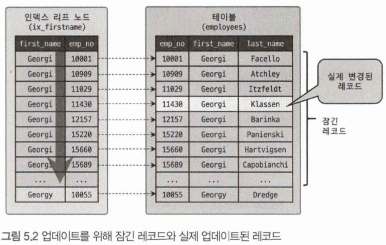

만약 테이블에 인덱스가 하나도 걸려있지 않다면 어떻게 될까?

30만건의 모든 레코드가 락이 거릴 것이다..

인덱스 설계가 중요한 이유..

### 레코드 수준의 잠금 확인 및 해제

레코드 수준 잠금은 테이블 수준 잠금보다 더 복잡하다.

테이블 수준의 잠금은 대상이 테이블 자체라 쉽게 문제의 원인이 발견되고 해결될 수 있다.

하지만 레코드 수준의 잠금은 레코드 각각에 잠금이 걸려 자주 사용되지 않으면 오랜 시간 잠긴 상태로 발견이 잘 안된다.

5.1버전 이전에는 레코드 잠금에 대한 메타 정보를 제공하지 않아 더 어려웠는데 **5.1부터는 레코드 잠금과 잠금 대기 조회가 가능**하다.

각 트랜잭션이 어떤 잠금을 기다리는지, 기다리는 잠금이 어떤 트랜재션이 가지고 있는지 메타 정보로 조회할 수 있다.

5.1 부터는 `information_schema`에 `INNODB_TRX`, `INNODB_LOCKS`, `INNODB_LOCK_WAITS` 테이블을 통해 확인 가능했다.

8.0 부터는 `performance_schema`의 `data_locks`와 `data_lock_waits` 테이블에서 확인 가능하다. (`information_schema` 정보들은 조금씩 Deprecated 되고 있음)

방법은 `REAL MySQL 8.0 1권` 173~176장을 참고하자.

## MySQL의 격리 수준

여러 트랜잭션이 동시에 처리될 때 특정 트랜잭션이 다른 트랜잭션에서 변경, 조회하는 데이터를 볼 수 있게 허용할지 말지 결정

### 격리 수준
- READ UNCOMMITTED
- READ COMMITTED
- REPEATABLE READ
- SERIALIZABLE

| -                | DIRTY READ | NON-REPEATABLE READ | PHANTOM READ |
|------------------|------------|---------------------|--------------|
| READ UNCOMMITTED | o          | o                   | o            |
| READ COMMITTED   | x          | o                   | o            |
| REPEATABLE READ  | x          | x                   | o(InnoDB는 x) |
| SERIALIZABLE     | x          | x                   | x            |

아래로 갈 수록 격리정도가 높아지며 동시 처리 성능도 떨어진다.

### READ UNCOMMITTED

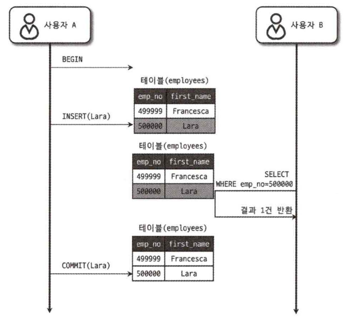

A 트랜잭션 처리가 완료되지 않았는데도 B 트랜잭션에서도 볼 수 있다. (Dirty Read)

### READ COMMITTED

오라클 DBMS의 기본 격리 수준

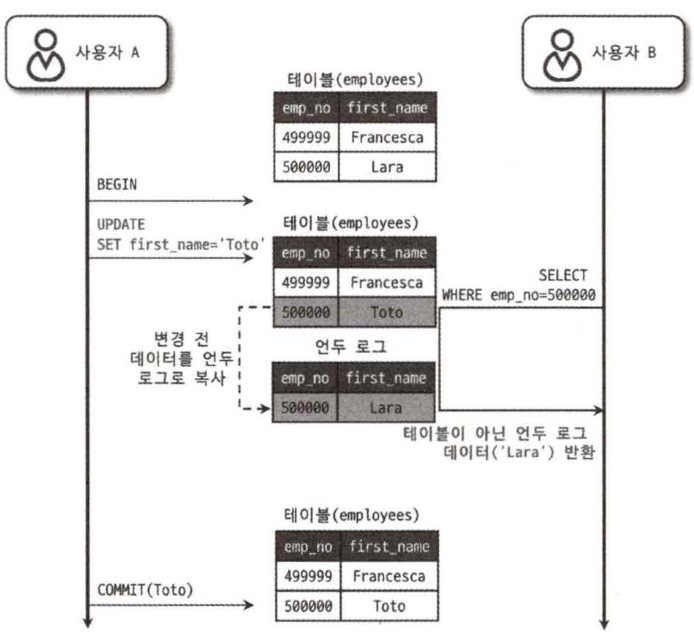

B의 SELECT 쿼리 결과는 employees 테이블이 아니라 언두 영역에 백업된 레코드에서 가져온 결과다.

`READ COMMITTED`에서는 `NON-REPEATABLE READ`라는 부정합의 문제가 발생한다.

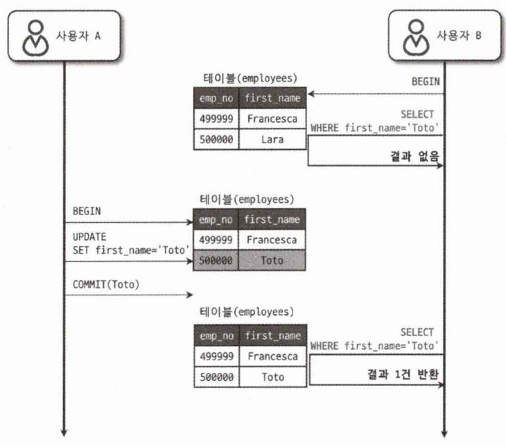

동일한 트랜잭션에서 같은 조건으로 조회했는데 다른 결과가 나오는 현상으로 정합성에 어긋난다.

일반적인 서비스에서는 큰 문제가 되지 않겠지만, 금전적인 처리와 연결되면 문제가 될 수 있다.

### REPEATABLE READ

MySQL의 InnoDB 스토리지 엔진의 기본 격리 수준

`NON-REPEATABLE READ`이 발생하지 않는다.

InnoDB는 트랜잭션이 `ROLLBACK`될 가능성에 대비해 변경 전 레코드를 언두 공간에 백업하고 실제 레코드 값을 변경한다. (MVCC 방식)

사실 `READ COMMITTED`도 MVCC를 이용해 `COMMIT`되기 전 데이터를 보여준다.

`REPEATABLE READ`와 `READ COMMITTED`의 차이는 언두 영역에 백업된 레코드의 여러 버전 중 n번째 이전까지 찾냐의 차이다.

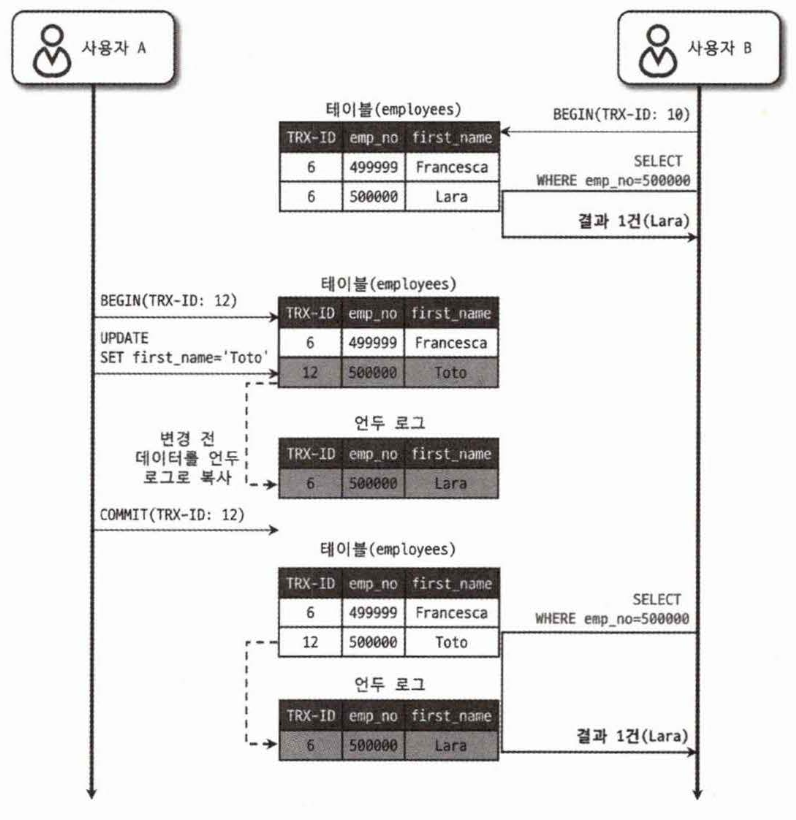

트랜잭션을 시작하고 장시간 종료하지 않으면 언두 영역에 백업 데이터가 무한정으로 커질 수 있어 서버 성능 저하가 발생할 수 있다.

`REPEATABLE READ`에서도 부정합이 발생하는 경우가 있다.

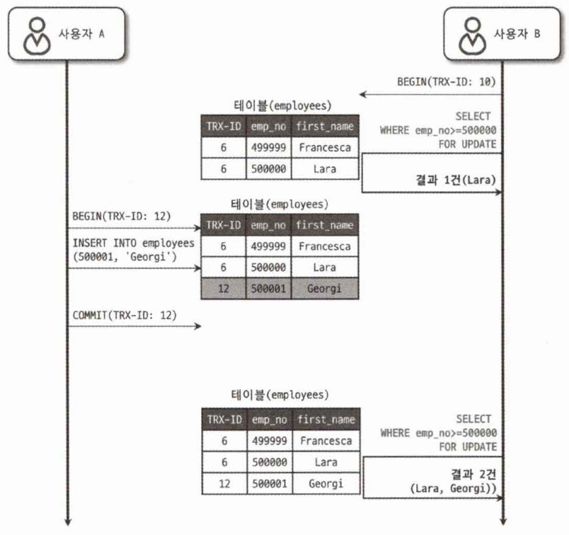

B 트랜잭션이 `SELECT ... FOR UPDATE` 조회하고 A 트랜잭션에서 `INSERT`가 되고 종료한 다음 B 트랜잭션에서`SELECT ... FOR UPDATE` 한다면 결과값이 다른 상황이 발생한다.

`SELECT ... FOR UPDATE`는 `SELECT`하는 레코드에 쓰기 잠금을 걸리지만 언두 레코드에는 잠금을 걸 수가 없어서 실제 테이블의 변경된 값을 가져오는 것이다.

# 06 데이터 압축

MySQL 디스크에 저장된 데이트 파일의 크기는 쿼리 처리 성능, 백업 및 복구 시간과 밀접하다.

데이터 파일이 크면 백업, 복구 시간이 오래 걸려 MySQL에서는 `테이블 압축`과 `페이지 압축`을 지원한다.

# 07 데이터 암호화

## 7.1 MySQL 데이터 암호화

InnoDB 엔진의 I/O 레이어에서만 데이터의 암호화 및 복호화 과정이 실행된다.

디스크에 저장된 단계에서만 암호화 된다.

# 08 인덱스

DB 쿼리 성능을 언급하면서 인덱스와 관련이 깊다.

## 8.1 디스크 읽기 방식

DB 성능 튜닝은 어떻게 디스크 I/O를 줄이느냐가 관건인 경우가 많다.

### HDD와 SSD

SSD는 HDD보다 랜덤 I/O가 훨씬 빠르다.

DB에서는 순차 I/O는 비중이 크지 않고 랜덤 I/O를 통한 작은 데이터를 읽고 쓰는 작업이 대부분이므로 SSD의 장점은 DB의 최적이다.

### 랜덤 I/O와 순차 I/O

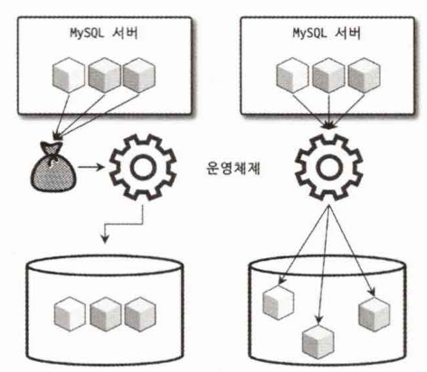

3개의 데이터를 조회한 경우 HDD에서는 순차I/O로는 1번 시스템콜을 하지만 랜덤 I/O는 3번 콜한다.

디스크 원판을 갖지 않은 SSD는 순차I/O와 랜덤I/O 차이가 없을 것으로 예측되지만 랜덤I/O의 스루풋이 순차I/O보다 떨어진다.

## 인덱스란?

`SortedList`는 DBMS의 인덱스와 같은 자료구조이며, `ArrayList`는 데이터 파일과 같은 자료 구조를 사용한다.

### `ArrayList`
- 데이터 파일이 사용하는 자료구조
- 값을 저장되는 순서대로 유지

### `SortedList`
- 인덱스가 사용하는 자료 구조
- 저장되는 값을 항상 정렬된 상태로 유지
- 저장할 때마다 항상 값을 정렬해서 과정이 복잡하고 느림
- 정렬되어 있어 아주 빨리 원하는 값을 찾을 수 있음
- 인덱스가 많은 테이블은 `INSERT`, `UPDATE`, `DELETE`가 느리지만 `SELECT`는 빠름

데이터 저장방식 알고리즘은 `B-Tree 인덱스`와 `Hash 인덱스`로 구분할 수 있다.

## `B-Tree 인덱스`

DB 인덱싱 알고리즘 중 가장 일반적으로 사용되고 가장 먼저 도입된 알고리즘이지만 아직도 가장 범용적인 알고리즘이다.

B는 Balanced의 약자이며 컬럼의 원래 값을 변형시키지 않고 항상 정렬된 상태로 유지한다.

### 구조 및 특성

`B-Tree`의 기본적인 구조는 최상위에 하나의 `루트노드`가 존재하고 그 하위에 자식 노드가 붙어 있는 형태.

트리에서 가장 하위 노드를 `리프노드(Leaf node)`라고 하며 `루트노드`와 `리프노드` 사이에 있는 노드는 `브랜치 노드(Branch node)`라고 한다.

인덱스와 실제 데이터는 따로 관리되는데, 인덱스의 `리프노드`는 실제 데이터의 레코드 주소값을 가지고 있다.

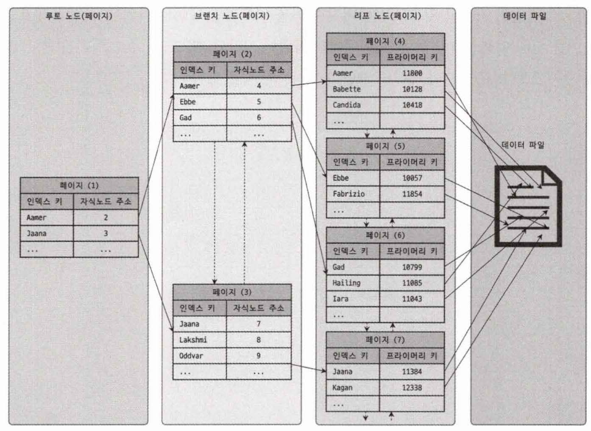

인덱스의 키 값은 정렬돼 있지만, 데이터 파일의 레코드는 정렬돼 있지 않고 임의의 순서대로 저장.

데이터파일의 레코드는 삽입된 순서대로 저장된다고 생각할 수 있지만, 실제로는 레코드가 삭제되면 빈 공간에 다음 `INSERT` 데이터가 삽입된다.

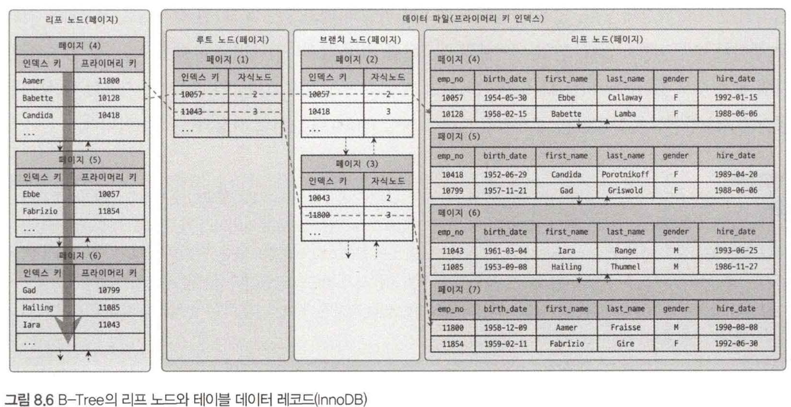

InnoDB 테이블은 인덱스를 통해 레코드를 읽을 때 데이터 파일을 바로 찾아가지 못한다.

인덱스에 저장돼 있는 PK값을 이용해 키 인덱스를 한번 더 검색한 후 프라이머리 키 인덱스의 리프 페이지에 저장돼 있는 레코드를 읽는다.

InnoDB는 모든 세컨더리 인덱스 검색으로 데이터를 읽기 위해서는 반드시 프라이머리 키 인덱스를 먼저 검색해서 데이터를 읽을 수 있다.

### B-Tree 인덱스 키 추가 및 삭제

테이블 레코드를 저장, 변경할 경우 인덱스 키 추가나 삭제 작업이 발생한다.

### 인덱스 키 추가

저장될 위치가 결정되면 레코드의 키 값과 대상 레코드의 주소 정보를 B-Tree의 리프노드에 저장.

리프 노드가 꽉 찰 경우 리프 노드가 분리돼야 하는데, 이는 상위 브랜치까지 처리의 범위가 넓어져서 쓰기 작업에 비용이 많이 든다.

InnoDB는 `INSERT`가 실행되면 즉시 새로운 키 값을 B-Tree 인덱스에 변경하지 않고 지연시켜 나중에 처리할 수 있다.

하지만 PK나 유니크키는 중복체크가 필요하여 즉시 B-Tree에 추가/삭제한다.

### 인덱스 키 삭제

삭제는 간단하다. B-Tree의 리프 노드를 찾아서 그냥 삭제 마크만 하면 작업이 완료된다.

### 인덱스 키 변경

인덱스의 키 값은 값에 따라 저장될 리프 노드의 위치가 결정돼서 키 값을 변경할 경우 단순히 인덱스상의 키 값만 변경하는 것은 불가능하다.

키 값 변경은 먼저 키 값을 삭제하고 다시 새로운 키 값을 추가한다.

### 인데스 키 검색

트리 탐색을 하여 인덱스 키 검색을 한다. `SELECT`에서만 사용하는게 아니라 `UPDATE` `DELETE` 처리를 위해서도 사용된다.

인덱스의 키 값에 변형이 가해진 후 비교되는 경우에는 절대 B-Tree의 빠른 검색 기능을 사용할 수 없다.

InnoDB에서는 레코드 락 또는 넥스트 키락이 검색을 수행한 인덱스 락 후 테이블 레코드를 락하는 방식이다.

따라서 `UPDATE`나 `DELETE`할 때 적절히 사용할 인덱스가 없으면 불필요하게 많은 레코드를 잠게 된다.

### B-Tree 인덱스 사용에 영향을 미치는 요소

!! B-Tree 추가 작성 필요 !!


## 클러스터링 인덱스

### 클러스터링 인덱스
클러스터링 인덱스(클러스터링 키)는 테이블의 PK라고 할 수 있다.

프라이머리 키 값에 의해 레코드의 저장 위치가 결정된다. PK 값이 변경된다면 레코드의 물리적인 저장 위치가 바뀐다.

PK 기반의 검색은 매우 빠르다. 하지만 레코드의 저장이나 PK의 변경이 상대적으로 느리다.

기본적으로 PK를 클러스터링 키로 선택되지만 PK가 없는 테이블도 클러스터링 키는 존재하는데 다음 우선순위로 지정한다.

1. `NOT NULL` 옵션의 유니크 인덱스 중에서 첫 번째 인덱스를 클러스터링 키로 지정
2. 테이블 내부적으로 자동으로 유니크한 값을 가지도록 증가되는 컬럼을 추가하고 클러스터링 키로 지정

1,2번과 같이 자동ㄹ으로 추가되는 경우 사용자에게 노출되지 않으며 쿼리 문에서도 명시적으로 사용할 수 없다.

즉, 아무런 성능적인 이점이 없으므로 PK를 명시적으로 생성하는게 좋다.

**클러스터링 인덱스의 장단점**

간단히 말하면 장점은 빠른 읽기 단점은 느린 쓰기다.

보통 웹 서비스에서 읽기와 쓰기의 비율이 9:1, 8:2 라서 조금 느린 쓰기를 감수하고 읽기를 빠르게 유지하는 것이 좋다.

### 세컨더리 인덱스

InnoDB 테이블의 모든 세컨더리 인덱스는 해당 레코드가 저장된 주소가 아니라 PK값을 저장한다.

세컨더리 인덱스로 조회가 발생하면 인덱스로 PK값을 찾고 클러스터링 인덱스인 PK로 최종 레코드를 찾는다.


