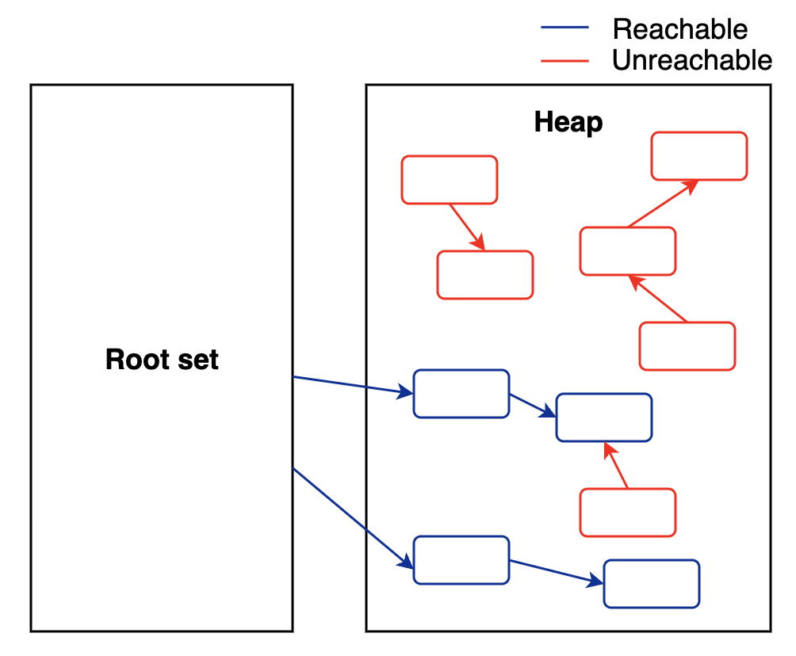

# Reference

## Overview

JDK 1.2 부터는 java.lang.ref 패키지를 추가해 제한적으로 사용자 코드와 GC가 상호작용할 수 있게 했습니다.

java.lang.ref 패키지는 전형적인 객체 참조인 strong reference 외에도 soft, weak, phantom 3가지의 새로운 참조 방식을 Reference 클래스로 제공합니다.

## GC와 Reachability

### GC

Garbage Collector 는 힙 영역에 사용하지 않는 메모리를 찾고 회수하는 역할을 합니다.

GC 가 실제로 언제 객체를 회수할지는 GC 알고리즘에 따라 모두 다르며 수행될 때마다 반드시 메모리까지 회수된다고 보장하지는 않습니다.

### Reachability

GC는 객체가 가비지인지 판별하기 위해 reachability 라는 개념을 사용합니다.

- reachable
  - 객체에 유효한 참조가 있다.
  - GC 대상이 아니다.
- unreachable
  - 객체에 유효한 참조가 없다.
  - GC 대상

유효한 참조 여부는 최초의 참조가 있어야하는데 root set 이라고 합니다.



이 그림에서 참조는 모두 java.lang.ref 패키지를 사용하지 않은 일반적인 참조이며, 이를 Strong Reference 라고 합니다.

## Soft, Weak, Phantom Reference

java.lang.ref 는 soft reference 와 weak reference, phantom reference 를 클래스 형태로 제공합니다.

```java
WeakReference<Sample> wr = WeakReference<Sample>(new Sample());
Sample ex = wr.get();
...
ex = null;
```

이렇게 생성된 WeakReference 객체는 Strong Reference 객체와 달리 GC가 특별하게 취급합니다.

### Weak Reference

Weak Reference 객체는 GC 를 수행할 때마다 회수 대상이 됩니다.

### Soft Reference

Soft Reference 객체로만 참조된 객체는 힙에 남아 있는 메모리의 크기와 해당 객체의 사용 빈도에 따라 GC 여부가 결정됩니다.

### Phantom Reference

Phantom Reference 는 거의 사용되지 않습니다.

## Conclusion

GC는 GC 대상 객체(Garbage)를 찾고, 대상 객체를 처리(finalization)하고, 메모리를 회수합니다.

java.lang.ref 패키지의 Soft, Weak, Phantom Reference 를 사용하여 GC에 일부 관여할 수 있습니다.