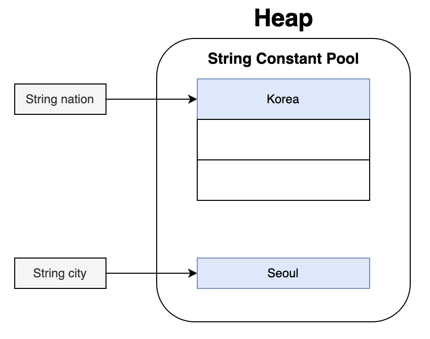
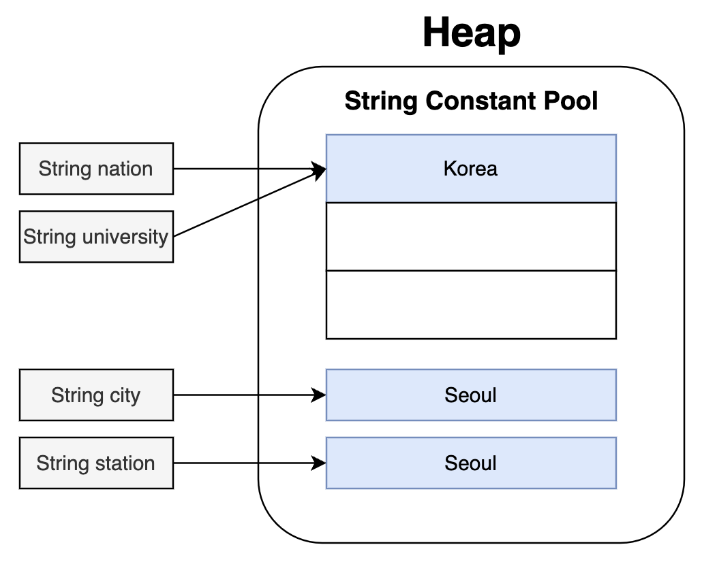

# String

## Overview

이 문서에서는 Java 의 String 에 대해서 알아봅니다.

## String 이란

두 문자 이상을 저장하기 위해 사용합니다.
<br/>
String 은 클래스이며 문자열 리터럴이라고도 합니다.

## String 선언 방법

String 을 선언하는 방법은 2가지가 있습니다.

```java
// 리터럴 선언
String nation = "Korea";

// 객체 선언
String city = new String("Seoul");
```

둘의 차이점은 무엇일까요?

## String Constant Pool

리터럴 선언과 객체 선언은 문법 차이 뿐 아니라 실제 메모리가 할당되는 영역에도 차이가 있습니다.



리터럴으로 선언하면 String Constant Pool 이라는 영역에 할당되고 객체로 선언하면 일반 객체처럼 Heap 영역에 할당됩니다.

그렇다면 왜 리터럴은 String Constant Pool 영역에 할당하고 어떤 이점이 있을까요?

예시를 보겠습니다.

```java
String nation = "Korea";
String university = "Korea";

String city = new String("Seoul");
String station = new String("Seoul");
```



문자열 리터럴로 선언한 nation과 university는 같은 메모리를 참조하고 있습니다.<br/>
즉, 문자열 리터럴로 선언하게 되면 내부적으로 (intern 메소드를 사용하여) String Constant Pool 에 생성하려는 문자열이 이미 존재할 경우 주소값을 반환하고 없다면 새로 객체를 생성하고 주소값을 반환합니다.

하지만 문자열 객체로 선언한 city와 station은 서로 다른 메모리를 참조하고 있습니다.

## Test

메모리 주소를 확인하여 실제 이론과 같이 동작하는지 확인해보겠습니다.

```java
@Test
void testString() {

    String nation = "Korea";
    String university = "Korea";

    String city = new String("Seoul");
    String station = new String("Seoul");

    System.out.println(System.identityHashCode(nation));
    System.out.println(System.identityHashCode(university));
    System.out.println(System.identityHashCode(city));
    System.out.println(System.identityHashCode(station));
    
    //결과
    //1896305732
    //1896305732
    //1823541245
    //1896232624
}
```

예상대로 리터럴 문자열은 같은 메모리 주소를 확인할 수 있고, 객체 문자열은 다른 메모리 주소에 할당하는 것을 확인할 수 있습니다.

### equals, ==

그렇다면 equals, ==의 결과는 어떻게 될까요?

```java
System.out.println(nation.equals(university));
System.out.println(nation == university);
System.out.println(city.equals(station));
System.out.println(city == station);

//결과
//true
//true
//true
//false
```

equals와 ==를 정확히 알고 있다면 결과를 이해할 수 있을 예상할 수 있습니다.

## Conclusion

보통 문자열을 표현할 때는 가독성에 이점이 있고 컴파일 시 최적화에 도움을 주는 문자열 리터럴을 사용하는 것이 좋습니다.
