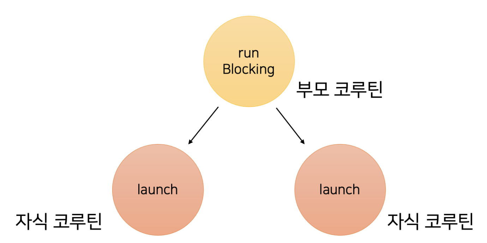

# 코루틴이란?

co-routine, 협력하는 루틴

# 루틴과 코루틴의 차이

## 루틴

```kotlin
fun main() {
    println("Start")
    newRoutine()
    println("End")
}

fun newRoutine() {
    val num1 = 1
    val num2 = 2
    println("${num1 + num2}")
}

// 실행결과
// Start
// 3
// End
```


메인루틴과 신규루틴 사이에는 진입하고 종료로 일어난다.

### 메모리 관점

신규루틴이 호출되면 newRoutine이 사용하는 스택에 지역변수가 초기화되고 newRoutine이 종료되면 스택이 해제된다.

정리하면 루틴에 진입하는 곳이 한 군데이며, 종료되면 해당 루틴의 정보가 초기화된다.

## 코루틴

```kotlin
fun main(): Unit = runBlocking {
    println("START")
    launch {
        newRoutine()
    }
    yield()

    println("END")
}

suspend fun newRoutine() {
    val num1 = 1
    val num2 = 2
    yield()
    println("${num1 + num2}")
}

// 실행결과
// START
// END
// 3
```

**runBlocking**

일반루틴 세계와 코루틴 세계를 연결한다.
runBlocking 함수 자체로 새로운 코루틴을 만든다.

**launch**

반환값이 없는 코루틴을 만든다.

**suspend fun**

다른 suspend 함수를 호출할 수 있다.

**yield**

현재 코루틴을 일시정지하고 다른 코루틴에게 실행을 양보한다. (스레드를 양보)

### 동작순서

```kotlin
fun main(): Unit = runBlocking {
    println("START") // 1
    launch { // 2
        newRoutine() // 4
    }
    yield() // 3

    println("END") // 8
}

suspend fun newRoutine() {
    val num1 = 1 // 5
    val num2 = 2 // 6
    yield() // 7
    println("${num1 + num2}") // 9
}
```


### 메모리 관점

새로운 루틴이 호출된 후 완전히 종료되기 전, 해당 루틴에서 사용했던 정보들을 보관하고 있어야한다.

루틴이 중단되었다가 해당 메모리에 접근이 가능하다.

### 실행된 코루틴 확인하기
```kotlin
fun main(): Unit = runBlocking {
    printWithTread("START")
    launch {
        newRoutine()
    }
    yield()

    printWithTread("END")
}

suspend fun newRoutine() {
    val num1 = 1
    val num2 = 2
    yield()
    printWithTread("${num1 + num2}")
}

fun printWithTread(str: Any) {
    println("Thread: ${Thread.currentThread().name} $str")
}

// 실행결과
// Thread: main @coroutine#1 START
// Thread: main @coroutine#1 END
// Thread: main @coroutine#2 3
```

## 스레드와 코루틴

### 프로세스

컴퓨터에서 실행되는 프로그램

### 스레드

프로세스에 소속되어 여러 코드를 동시에 실행할 수 있게 해줌

### 코루틴

코루틴의 코드를 실행하려면, 스레드에 넘겨서 실행한다.

중단하고 재개될 때 다른 스레드에서 처리될 수 있다.

하나의 스레드에서 동시성을 확보할 수 있다.

### 스레드와 코루틴의 차이

**스레드**
- 프로세스보다 작은 개념
- 한 스레드는 오직 한 프로세스에만 포함
- context switching 발생시 stack 영역이 교체된다.
- OS가 스레드를 강제로 멈추로 다른 스레드를 실행(선점형)

**코루틴**
- 스레드보다 작은 개념
- 코루틴 코드는 여러 스레드에서 실행될 수 있다.
- context switching 발생 시 메모리 교체가 없다.
(한 스레드에서 실행한 경우)
- 코루틴 스스로가 다른 코루틴에게 양보(비선점형)

## 코루틴 빌더와 job

### 1. runBlocking

새로운 코루틴을 만들고, 루틴 세계와 코루틴 세계를 이어준다. 코루틴 빌더라고 부름

runBlocking 본인과 안에 있는 코루틴이 모두 완료될 때까지 스레드를 블로킹한다.

```kotlin
fun main(): Unit = runBlocking {

}
```

```kotlin
fun main() {
    runBlocking {
        printWithThread("START")
        launch {
            delay(2_000L)
            printWithThread("LAUNCH END")
        }
    }
    printWithThread("END")
}

// 결과
// [main] START
// [main] LAUNCH END 
// [main] END <- runBlocking으로 블로킹 되어 2초뒤 출력됨
```

### 2. launch

반환값이 없는 코드를 실행

코루틴을 제어할 수 있는 객체 Job을 반환 받는다. (제어: 시작/취소/종료시 까지 대기)

```kotlin
fun main(): Unit = runBlocking {
    val job = launch {
        printWithThread("Hello launch")
    }
}
```
**start(): 시작신호**
```kotlin
fun main(): Unit = runBlocking {
    val job = launch(start = CoroutineStart.LAZY) {
        printWithThread("Hello launch")
    }

    delay(1_000L)
    job.start()
}
```
`launch(start = CoroutineStart.LAZY)`는 코루틴을 제어할 수 있는 job객체를 통해 `start()`를 호출하지 않으면 실행되지 않는다.

**cancel(): 취소신호**
```kotlin
fun main(): Unit = runBlocking {
    val job = launch {
        (1..5).forEach {
            printWithThread(it)
            delay(500)
        }
    }
    delay(1_000L)
    job.cancel()
}
```
1,2는 출력되지만 1초뒤에 job이 취소되어 3,4,5는 출력되지 않는다.

**join() : 코루틴이 완료될 때까지 대기**
```kotlin
fun main(): Unit = runBlocking {
    val job1 = launch {
        delay(1_000L)
        printWithThread("Job 1")
    }
    job1.join()

    val job2 = launch {
        delay(1_000L)
        printWithThread("Job 2")
    }
}
```

### 3. async

주어진 함수의 실행 결과를 반환할 수 있다.

여러 API를 동시에 호출하여 소요시간을 최소화할 수 있다.

```kotlin
fun main(): Unit = runBlocking {
    val job = async {
        3 + 5
    }

    val result = job.await() // await()은 async의 결과를 가져오는 함수
    printWithThread(result)
}

// 8
```

```kotlin
fun main(): Unit = runBlocking {
    val time = measureTimeMillis {
        val job1 = async { apiCall1() }
        val job2 = async { apiCall2() }
        printWithThread(job1.await() + job2.await())
    }
    printWithThread("소요 시간: $time ms")
}

suspend fun apiCall1(): Int {
    delay(1_000L)
    return 1
}

suspend fun apiCall2(): Int {
    delay(1_000L)
    return 2
}
// 결과
// [main @coroutine#1] 3
// [main @coroutine#1] 소요 시간 : 1049 ms
```

async는 callback을 이용하지 않고 동기방식으로 코드를 작성할 수 있는 장점이 있다.

```kotlin
fun main(): Unit = runBlocking {
    val time = measureTimeMillis {
        val job1 = async(start = CoroutineStart.LAZY) { apiCall1() }
        val job2 = async(start = CoroutineStart.LAZY) { apiCall2() }

        job1.start()
        job2.start()
        printWithThread(job1.await() + job2.await()) // start()를 하지 않으면 job1의 결과를 대기함
    }
    printWithThread("소요 시간: $time ms")
}
```

`async(start = CoroutineStart.LAZY)`옵션을 사용하면 `await()`이 호출될 때 계산 결과를 계속 기다린다.

사용해야되는 상황이면 start() 함수를 호출해주면 괜찮다.

## 코루틴 취소

코루틴을 적절히 취소하는 것은 중요하다

필요하지 않은 코루틴을 적절히 취소해 컴퓨터 자원을 아껴야함

cancel() 함수를 활용하면 되지만, 코루틴 취소에 협조해 주어야한다.

### 취소협조 방법

1. delay() 또는 yield() 같은 kotlinx.coroutines 패키지의 suspend 함수 사용
2. 코루틴 스스로의 상태를 확인하고 취소요청을 받으면 CancellationException 던지기

## 코루틴의 예외처리와 Job 상태 변화

```kotlin
fun main(): Unit = runBlocking {
    val job1 = launch {
        delay(1_000L)
        printWithThread("Job 1")
    }

    val job2 = launch {
        delay(1_000L)
        printWithThread("Job 2")
    }
}
```


