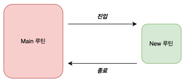
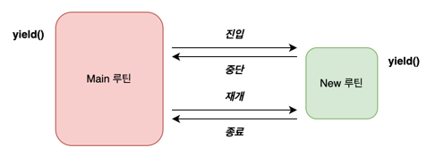

# 코루틴이란?

co-routine, 협력하는 루틴

# 루틴과 코루틴의 차이

## 루틴

```kotlin
fun main() {
    println("Start")
    newRoutine()
    println("End")
}

fun newRoutine() {
    val num1 = 1
    val num2 = 2
    println("${num1 + num2}")
}

// 실행결과
// Start
// 3
// End
```



메인루틴과 신규루틴 사이에는 진입하고 종료로 일어난다.

### 메모리 관점

신규루틴이 호출되면 newRoutine이 사용하는 스택에 지역변수가 초기화되고 newRoutine이 종료되면 스택이 해제된다.

정리하면 루틴에 진입하는 곳이 한 군데이며, 종료되면 해당 루틴의 정보가 초기화된다.

## 코루틴

```kotlin
fun main(): Unit = runBlocking {
    println("START")
    launch {
        newRoutine()
    }
    yield()

    println("END")
}

suspend fun newRoutine() {
    val num1 = 1
    val num2 = 2
    yield()
    println("${num1 + num2}")
}

// 실행결과
// START
// END
// 3
```

**runBlocking**

일반루틴 세계와 코루틴 세계를 연결한다.
runBlocking 함수 자체로 새로운 코루틴을 만든다.

**launch**

반환값이 없는 코루틴을 만든다.

**suspend fun**

다른 suspend 함수를 호출할 수 있다.

**yield**

현재 코루틴을 일시정지하고 다른 코루틴에게 실행을 양보한다. (스레드를 양보)

### 동작순서

```kotlin
fun main(): Unit = runBlocking {
    println("START") // 1
    launch { // 2
        newRoutine() // 4
    }
    yield() // 3

    println("END") // 8
}

suspend fun newRoutine() {
    val num1 = 1 // 5
    val num2 = 2 // 6
    yield() // 7
    println("${num1 + num2}") // 9
}
```



### 메모리 관점

새로운 루틴이 호출된 후 완전히 종료되기 전, 해당 루틴에서 사용했던 정보들을 보관하고 있어야한다.

루틴이 중단되었다가 해당 메모리에 접근이 가능하다.