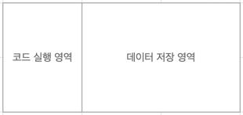
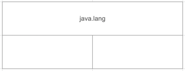
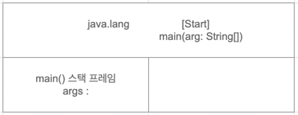
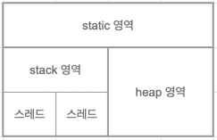
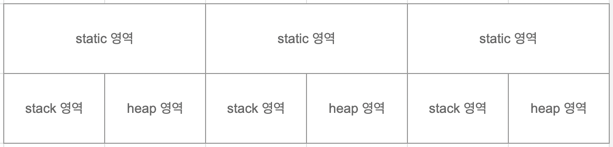
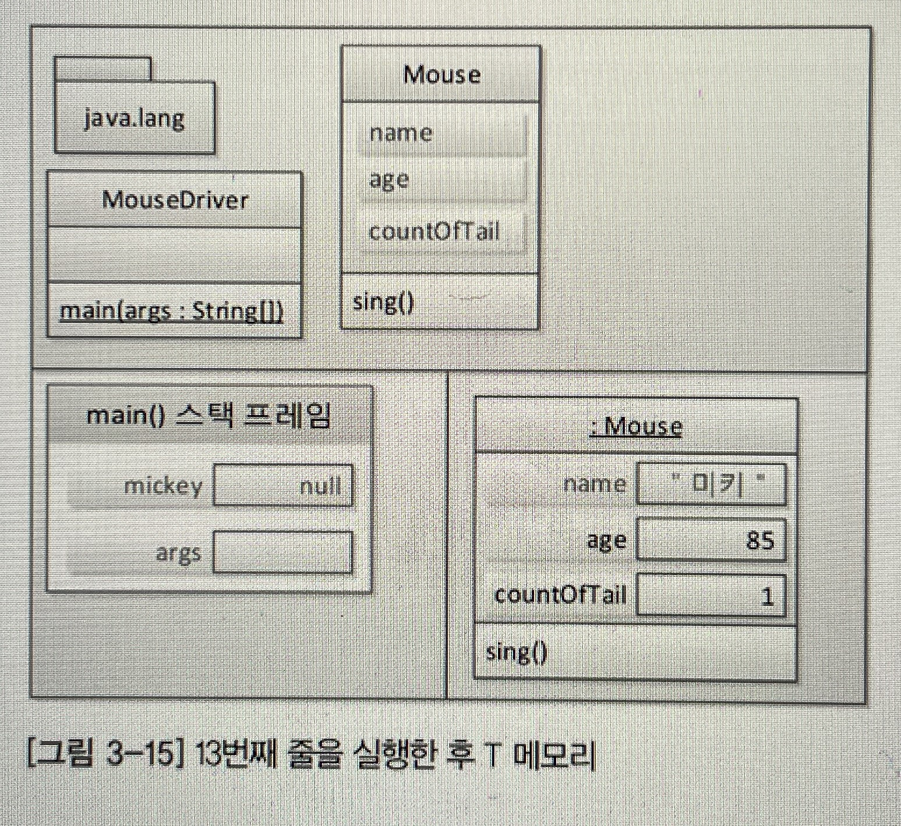
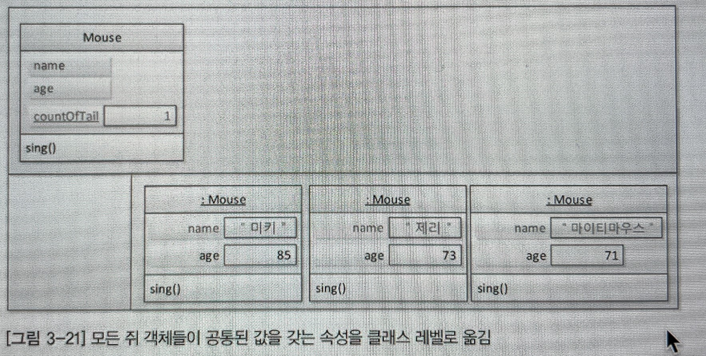
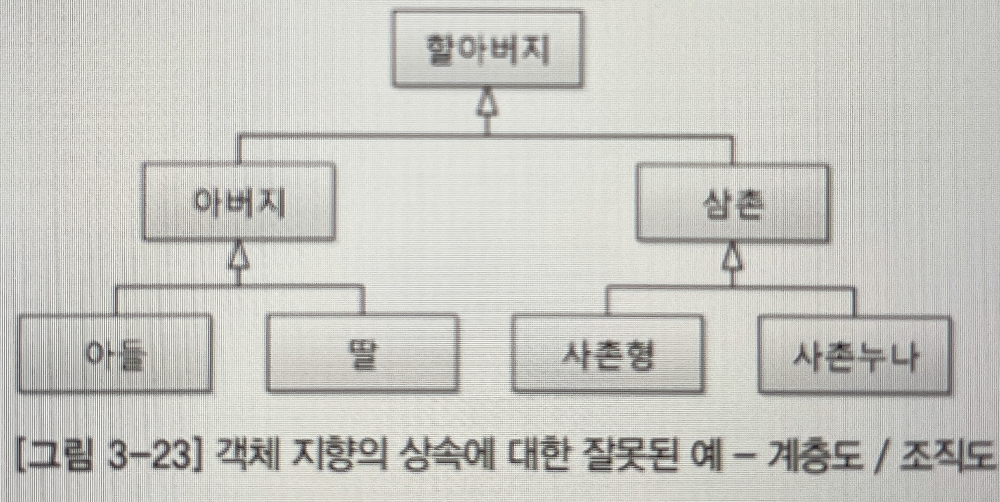
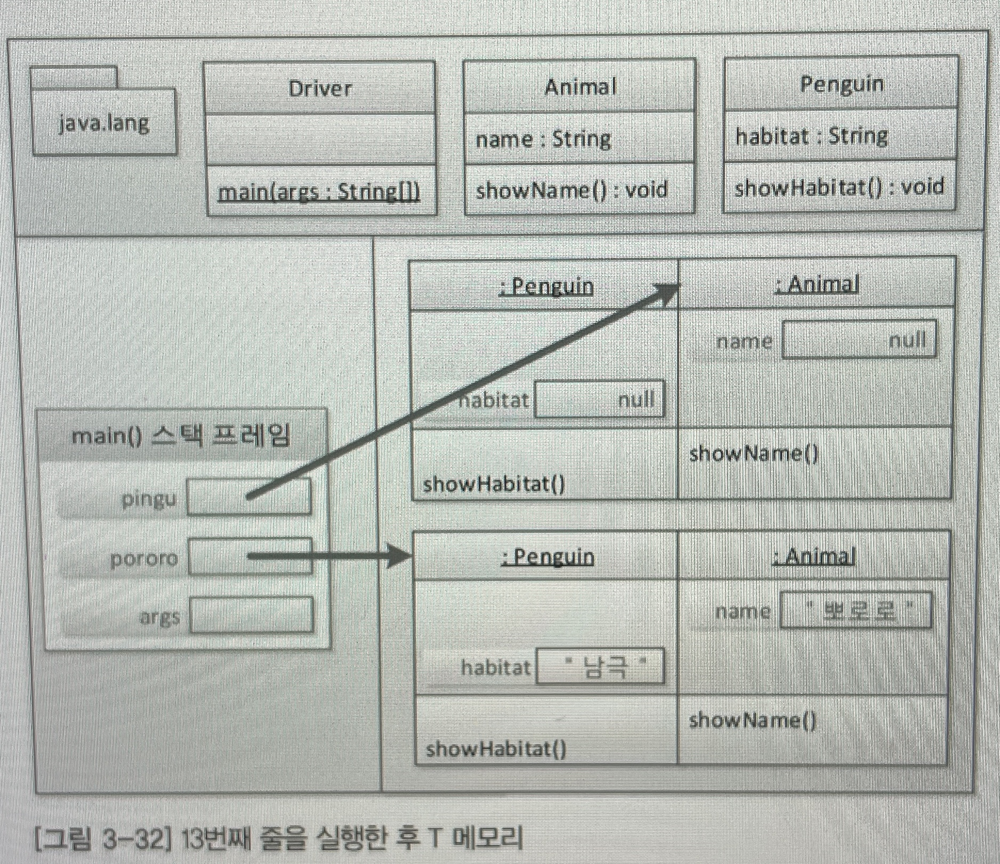

[스프링 입문을 위한 자바 객체지향의 원리와 이해](https://ebook-product.kyobobook.co.kr/dig/epd/ebook/4808998139940)

# 01 사람을 사랑한 기술
객체지향 언어의 중심에는 클래스(객체)가 있다.<br>
자바에서는 클래스를 떠나 존재할 수 있는 것은 아무것도 없다.<br>
모든 메서드도 클래스 메서드명()으로 접근해야 한다.<br>
SOA : Service Oriented Architecture 서비스 지향 구조<br>
스프링은 OOP 프레임워크<br>
스프링을 지배하는 근본적인 요소 - IoC/DI, AOP, PSA

결론적으로 알아야할 것
- OOP 개념
- 자바 언어의 문법
- 자바가 OOP 개념을 구현한 방식

# 02 자바와 절차적/구조적 프로그래밍

JDK
- Java Development Kit
- 자바 개발 도구
- 자바 소스 컴파일러인 javac.exe를 포함

JRE
- Java Runtime Environment
- 자바 실행 환경
- 자바 프로그램 실행기인 java.exe를 포함

JDK와 JRE를 나눈 이유
- 각 플랫폼용으로 배포되는 설치파일을 각각 준비해야 했던 불편함을 없애기 위해

함수와 메서드의 차이점
- 함수는 클래스나 객체와 아무런 관계가 없지만 메서드는 반드시 클래스 정의 안에 존재해야 한다.

**프로그램이 메모리를 사용하는 방식**



**객체 지향 프로그램의 메모리 사용 방식**


데이터 저장 영역에서 나뉜 세가지 영역은 그림과 같이 T처럼 보이기에 T 메모리 구조라고 부른다.

## main() 메서드: 메서드 스택 프레임
main() 메서드는 프로그램이 실행되는 시작점이다.

```java
public class Start {
    public static void main(String[] args) {
        System.out.println("Hello OOP!!!");
    }
}
```

프로그램이 시작되면 JRE는 먼저 프로그램 안에 main() 메서드가 있는지 확인한다.<br>
JRE는 Start 클래스에서 main() 메서드를 발견한다.<br>
JRE는 JVM을 부팅한다. 그리고 JVM은 전처리 작업을 한다.<br>

**main() 메서드 실행 준비 1단계**



JVM 은 모든 자바 프로그램이 반드시 포함하게 되는 java.lang 패키지를 T 메모리의 스택 영역에 가져다 놓는다.

**main 메서드 실행 준비 2단계**


작성한 모든 클래스와 임포트 패키지 역시 스태틱 영역에 가져다 놓는다.

**main() 메서드가 실행되기 전 JVM에서 수행하는 전처리 작업들**
- java.lang 패키지를 T 메모리의 스태틱 영역에 배치
- import된 패키지를 T 메모리의 스태틱 영역에 배치
- 프로그램 상의 모든 클래스를 T 메모리의 스태틱 영역에 배치


메서드의 놀이터는 stack 영역이다.<br>
코드에서 여는 중괄호를 만날 때마다 스택 프레임이 하나씩 생긴다. (클래스 중괄호 제외)



main 메서드의 인자 args를 저장할 변수 공간을 할당한다.

## 멀티 스레드 / 멀티 프로세스의 이해


멀티스레드의 T 메모리 모델은 스택 영역을 스레드 개수만큼 분할해서 사용



멀티 프로세스는 다수의 T 메모리를 갖는 구조

# 03 자바와 객체 지향

### 객체지향은 인간 지향이다.

기계 종속적인 개발에서 벗어나 사람이 눈으로 보고 느끼고 생활하는 현실 세계처럼 프로그래밍하기위한 고민 속에서 객체 지향의 개념이 탄생했다.<br>
우리가 주변에서 사물을 인지하는 방식대로 프로그래밍하는게 객체 지향의 출발이다.

- 세상에 존재하는 모든 것은 사물, 즉 객체이다.
- 각각의 사물은 고유하다.
- 사물은 속성을 갖는다.
- 사물은 행위를 한다.

사물을 하나하나 이해하기보다는 사물을 분류(class)해서 이해하는 것이 인간의 인지법이다.

- 직립보행을 하며 말을 하는 존재를 사람이라고 분류한다.
- 연미복, 짧은 다리, 날지 못하는 새를 펭귄이라고 분류한다.
- 밤하늘에 반짝이는 사물들을 별이라고 분류한다.

유재석 손흥민 디카프리오라고 하는 존재는 사람이라는 분류에 속한다.<br>
그리고 사람이라는 분류 안의 객체들은 나이, 몸무게, 키 등의 속성과 먹다, 자다, 울다 등의 행위(method)를 가지고 있다.

### 객체 지향의 4대 특성
 
**캡슐화 Encapsulation**

정보은닉 Information hiding

**상속 Inheritance**

상속

**추상화 Abstraction**

모델링

**다형성 Polymorphism**

사용 편의

### 클래스 vs 객체 = 붕어빵틀 vs 붕어빵 ???

많은 책에서 붕어빵틀과 붕어빵을 비유하여 클래스와 객체를 설명한다.

> 클래스 객체명 = new 클래스();<br>
> 붕어빵틀 붕어빵 = new 붕어빵틀();

잘못된 개념이다.

클래스는 분류에 대한 개념이지 실체가 아니다.

객체는 실체다.

> 클래스 : 객체 = 사람 : 유재석

### 추상화: 모델링

추상화란 구체적인 것을 분해해서 관찰자가 관심 있는 특성만 가지고 재조합하는 것이라고 정리할 수 있다.

객체 지향의 4대 특성은 클래스를 통해 구현된다.

객체: 세상에 존재하는 유일무이한 사물

클래스: 분류, 집합, 같은 속성과 기능을 가진 객체를 총칭하는 개념

> 사람 홍길동 = new 사람();<br>
사람 줄리엣 = new 사람();

클래스를 이용해 object를 만들었다면 object라는 표현보다는 클래스의 인스턴스라는 표현을 쓴다.

> 객체(object) = 클래의 인스턴스

사람이라는 클래스를 설계할 때 사람 객체들이 가진 공통된 특성을 찾게된다.

시력, 몸무게, 혈액형, 키, 나이 등등 명사로 표현되는 특성을 속성이라고 한다.

속성을 값을 가질 수 있다.

먹다, 자다, 일하다, 울다 등등 동사로 표현되는 특성을 기능/행위라고 하는데 객체 지향에서는 메서드라고 한다.

사람 클래스가 사람 객체들의 모든 특성을 나열할 필요가 없다.

이제 애플리케이션의 경계라는 개념이 나온다.

'내가 만들고자 하는 애플리케이션은 어디에서 사용될 것인가?' 라는 질문을 할 수 있다.

병원 애플리케이션을 만든다면 사람은 환자를 의미하는 좀 더 구체적인 이름으로 바꿀 수 있고, 클래스 설계도 달라진다. 은행 애플리케이션이라면 사람은 고객이라는 구체적인 이름으로 바꿀 수 있다.

추상화란 구체적인 것을 분해해서 관심 영역에 대한 특성만을 가지고 재조합하는 것

IT용어로 바꾼다면

> 추상화란 구체적인 것을 분해해서 관심 영역에 있는 특성만 가지고 재조합하는 것 = 모델링

모델은 실제 사물을 정확히 복제하는 게 아니라 목적에 맞게 관심 있는 특성만 추출해서 표현하는 것이다.

자바는 객체 지향의 추상화를 class 키워드를 통해서 지원하고 있다.

> 추상화 = 모델링 = 자바의 class 키워드

### 추상화와 T메모리

```java
public class Mouse {
	public String name;
	public int age;
	public int countOfTail;
	
	public void sing() {
		System.out.println("찍찍");
	}
}

public class MouseDriver {
	public static void main(String[] args) {
		Mouse mickey = new Mouse();
		
		mickey.name = "미키";
		mickey.age = 85;
		mickey.countOfTail = 1;
		
		mickey.sing();
		
		mickey = null;
		
		Mouse jerry = new Mouse();
		
		jerry.name = "제리";
		jerry.age = 73;
		jerry.countOfTail = 1;
		
		jerry.sing();
	}
}
```




```java
public class Mouse {
	public String name;
	public int age;
	public static int countOfTail = 1;
	
	public void sing() {
		System.out.println("찍찍");
	}
}

public class MouseDriver {
	public static void main(String[] args) {
		Mouse.countOfTail = 1;
		
		Mouse mickey = new Mouse();
		Mouse jerry = new Mouse();
		Mouse mightyMouse = new Mouse();
		
		System.out.println(mickey.countOfTail);
		System.out.println(jerry.countOfTail);
		System.out.println(mightyMouse.countOfTail);
		
		System.out.println(Mouse.countOfTail);
	}
}
```



|이름|다른이름|사는곳|
|---|---|---|
|static 변수|클래스[멤버] 속성, 정적 변수, 정적 속성...|static|
|인스턴스 변수| 객체[멤버] 속성, 객체 변수...|heap|
|local 변수|지역 변수|스택 영역(스택 프레임 내부)|

### 상속 : 재사용+확장

잘못된 상속의 예시



동물은 포유류의 부모가 아니다.


동물의 분류를 세분화하면 포유류와 조류가 있고 포유류를 세분화하면 고래와 박쥐가 있다.

객체 지향에서의 상속은 상위 클래스의 특성을 하위 클래스에서 상속하고 거기에 필요한 특성을 추가하여 확장해서 사용할 수 있다는 의미이다.

상위 클래스 하위 클래스 명칭을 사용하자.

vs구체화(특수화).jpg)

상위 클래스쪽으로 갈수록 추상화/일반화 됐다고 말하며, 하위 클래스 쪽으로 갈수록 구체화/특수화됐다고 말한다.

상속관계에서 반드시 만족해야할 문장 : 하위 클래스는 상위 클래스다.

- 객체 지향의 상속은 상위 클래스의 특성을 재사용하는 것이다.
- 객체 지향의 상속은 상위 클래스의 특성을 확장하는 것이다.
- 객체 지향의 상속은 is a kind of 관계를 만족해야 한다.

### 상속과 인터페이스

인터페이스

- 구현 클래스 is able to 인터페이스
- 구현 클래스는 인터페이스할 수 있다.
- 고래는 헤엄칠 수 있다.


- Serializable 인터페이스 : 직렬화할 수 있는
- Cloneable 인터페이스 : 복제할 수 있는
- Comparable 인터페이스 : 비교할 수 있는
- Runnable 인터페이스 : 실행할 수 있는

상위 클래스는 물려줄 특성이 풍부할수록 좋고, (LSP 원칙)

인터페이스는 구현을 강제할 메서드의 개수가 적을수록 좋다. (ISP 원칙)

### 상속과 T 메모리

```java
public class Animal {
    public String name;
    
    public void showName() {
        System.out.printf("안녕 나는 %s야", name);
    }
}

public class Penguin extends Animal {
    public String habitat;
    
    public void showHabitat() {
        System.out.printf("%s는 %s에 살아", name, habitat);
    }
}

public class Driver {
    public static void main(String[] args) {
        Penguin pororo = new Penguin();
        
        pororo.name = "뽀로로";
        pororo.habitat = "남극";
        
        pororo.showName();
        pororo.showHabitat();
        
        Animal pingu = new Penguin();
        
        pingu.name = "핑구";
        
        pingu.showName();
    }
}
```



### 다형성: 사용편의성

객체 지향에서 다형성은 기본적으로 오버라이딩과 오버로딩

**오버라이딩**

상위 클래스의 메서드를 재정의

**오버로딩**

다른 인자 갯수 또는 타입으로 같은 메서드명 중복 정의

### 캡슐화: 정보 은닉

자바에서 정보은닉은 접근 제어자이다.

> 정리
> 
> 객체 지향의 4대 특성 : 캡슐화 상속 추상화 다형성
> 

# 자바가 확장한 객체 지향

