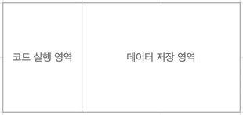
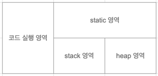
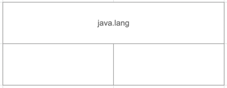
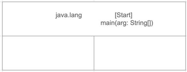
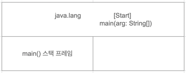
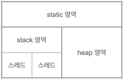

# 02 자바와 절차적/구조적 프로그래밍

JDK

- Java Development Kit
- 자바 개발 도구
- 자바 소스 컴파일러인 javac.exe를 포함

JRE

- Java Runtime Environment
- 자바 실행 환경
- 자바 프로그램 실행기인 java.exe를 포함

JDK와 JRE를 나눈 이유

- 각 플랫폼용으로 배포되는 설치파일을 각각 준비해야 했던 불편함을 없애기 위해

함수와 메서드의 차이점

- 함수는 클래스나 객체와 아무런 관계가 없지만 메서드는 반드시 클래스 정의 안에 존재해야 한다.

**프로그램이 메모리를 사용하는 방식**



**객체 지향 프로그램의 메모리 사용 방식**



데이터 저장 영역에서 나뉜 세가지 영역은 그림과 같이 T처럼 보이기에 T 메모리 구조라고 부른다.

## main() 메서드: 메서드 스택 프레임

main() 메서드는 프로그램이 실행되는 시작점이다.

```java
public class Start {

    public static void main(String[] args) {
        System.out.println("Hello OOP!!!");
    }
}
```

프로그램이 시작되면 JRE는 먼저 프로그램 안에 main() 메서드가 있는지 확인한다.<br>
JRE는 Start 클래스에서 main() 메서드를 발견한다.<br>
JRE는 JVM을 부팅한다. 그리고 JVM은 전처리 작업을 한다.<br>

**main() 메서드 실행 준비 1단계**



JVM 은 모든 자바 프로그램이 반드시 포함하게 되는 java.lang 패키지를 T 메모리의 스택 영역에 가져다 놓는다.

**main 메서드 실행 준비 2단계**



작성한 모든 클래스와 임포트 패키지 역시 스태틱 영역에 가져다 놓는다.

**main() 메서드가 실행되기 전 JVM에서 수행하는 전처리 작업들**

- java.lang 패키지를 T 메모리의 스태틱 영역에 배치
- import된 패키지를 T 메모리의 스태틱 영역에 배치
- 프로그램 상의 모든 클래스를 T 메모리의 스태틱 영역에 배치



메서드의 놀이터는 stack 영역이다.<br>
코드에서 여는 중괄호를 만날 때마다 스택 프레임이 하나씩 생긴다. (클래스 중괄호 제외)


main 메서드의 인자 args를 저장할 변수 공간을 할당한다.

## 멀티 스레드 / 멀티 프로세스의 이해



멀티스레드의 T 메모리 모델은 스택 영역을 스레드 개수만큼 분할해서 사용


멀티 프로세스는 다수의 T 메모리를 갖는 구조

