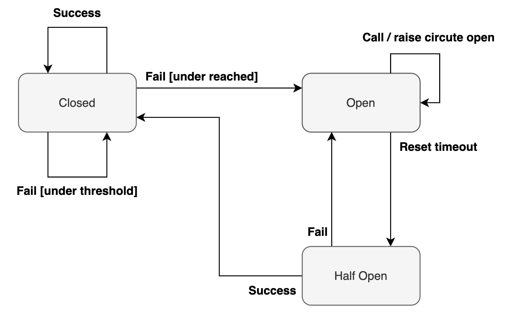

# Circuit Breaker

## Overview

소프트웨어는 모두 실패한다. 실패하지 않는 시스템을 만드는 것은 불가능하다.

우리는 완벽한 시스템을 만들기 보다, 실패에 빠르고 유연하게 대응할 수 있는 시스템을 만드는 것에 더 무게를 두어야한다.

MSA 같은 분산 환경에서는 한 서비스의 장애가 서비스 전체의 장애로 이어질 수 있다.

## 분산 환경 장애 전파

- 서비스 B에 장애가 발생했다.
- B로 요청을 한 서비스 A의 모든 스레드는 에러 응답을 받거나 타임아웃까지 응답을 받지 못한다.
- 에러 응답을 받으면, 서비스 A에 요청한 클라이언트는 항상 에러를 응답받게 될 것이다.
- 타임아웃이 발생하면 서비스 A의 모든 쓰레드가 B의 응답을 받을 때까지 대기하게 되고, 쓰레드가 고갈되는 상황이 발생한다.
- 핵심은 서비스 B의 장애로 인해 서비스 A까지 장애가 전파된다는 것이다.
- 하나의 서비스가 전체의 장애로 이어질 수 있다.
- 전체 장애로 이어지면 장애 시작점을 파악하기 쉽지 않다.

## 서킷 브레이커 패턴

분산 환경 장애 전파를 해결하기 위해서 등장한 것이 서킷 브레이커 패턴이다.

서킷 브레이커는 다른 서비스에 대한 호출을 모니터링하며, 요청의 실패율이 일정 임계치(threshold)를 넘어가면, 장애가 발생한 서비스로의 요청을 차단하여 Fail Fast 하는 방법이다.

서킷 브레이커는 Closed, Open, Half Open 3가지의 상태를 갖는다.

- Closed : 요청 실패율이 정해놓은 임계치보다 낮은 상태. 평소대로 모든 요청이 처리된다.
- Open : 요청 실패율이 정해놓은 임계치보다 높아진 상태. 서킷 브레이커가 열린 경우, 요청을 보내지 않고 즉시 실패처리 한다.
- Half Open : Open 이후 일정 시간이 지나면 Half Open 된다. 이 상태에서 요청이 성공하면 Closed 상태로 변경되고, 실패하면 Open 상태를 유지한다.

