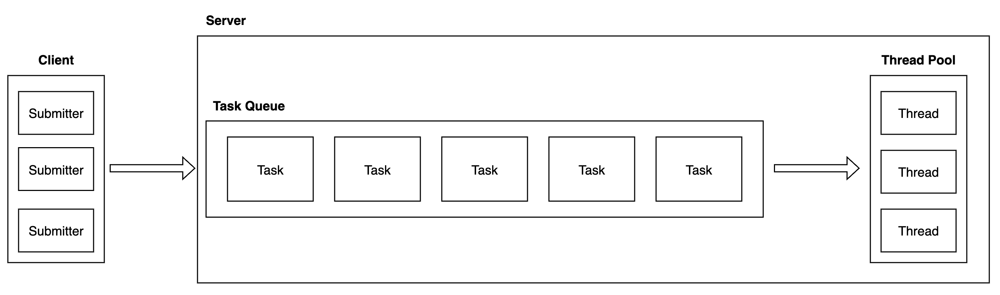

# 스프링 부트의 다중 요청 처리

## Overview

결론부터 말하자면 스프링 부트가 다중 요청 처리를 한다기보다는 스프링 부트에 내장되어 있는 서블릿 컨테이너에서 다중 요청을 처리해준다.

대표적인 서블릿 컨테이너는 Tomcat 이다.

## 다중 처리 동작 원리

- Tomcat이 부팅할 때 스레드풀을 생성한다.
- 요청(HttpServletRequest)이 들어오면 스레드풀에서 요청에 대해 스레드를 할당한다.
- 할당된 스레드는 스프링의 Dispatcher Servlet을 거쳐 요청을 처리한다.
- 작업이 완료되면 스레드는 스레드풀로 반환된다.

## 스프링 부트와 내장 톰캣

스프링 부트에는 내장 톰캣을 지원한다.

그래서 application.yml 설정으로 Tomcat 설정을 할 수 있다.

아래 설정은 스프링 부트의 기본 값이다.

```yaml
server:
  port: 8080
  tomcat:
    threads:
      max: 200 # 생성할 수 있는 스레드 총 개수
      min-spare: 10 # 항상 활성화 되어 있는 스레드 개수
    max-connections: 8192 # 수립 가능한 커넥션 총 개수
    accept-count: 100 # 작업큐 사이즈
    connection-timeout: 20000 # 20초
```

## 스레드풀 설정

### 스레드풀이란

스레드풀은 실행에 필요한 스레드를 미리 생성해 놓은 것이다.

아주 오래전 이야기지만 Tomcat 3.2 이전 버전에서는 요청이 들어올 때 마다 Thread를 생성하고 요청이 끝나면 destroy 했다.

이런 동작은 두 가지 문제가 있다.

1. 모든 요청에 대해 스레드를 생성하고 소멸하는 것은 OS와 JVM에 많은 부담이 된다.
2. 동시에 대용량 요청이 들어올 경우 리소스 소모에 대한 억제가 힘들다. 순간적으로 서버가 다운되거나 동시다발적인 요청을 처리하지 못해 문제가 발생할 수 있다.

이 문제를 해결하기 위해 톰캣은 스레드풀을 활용했다.



**스레드풀의 기본 플로우**

1. 톰캣이 실행되면 core size (min-spare) 만큼 스레드풀에 스레드를 생성한다.
2. 작업 요청이 들어오면 작업큐에 담는다.
3. 스레드풀에서 idle(유휴) 상태인 스레드가 있으면 작업큐에서 꺼내고 스레드에 작업을 할당하여 처리한다.
   1. 만약 idle 상태인 스레드가 없다면 idle 상태의 스레드를 기다린다.
   2. 이 상태로 작업큐까지 꽉 차면 스레드를 새로 생성한다.
   3. 스레드가 계속 생성되다가 최대 사이즈에 도달하고 작업큐도 꽉 차면, 추가 요청에 대해서는 connection-refused 오류를 반환한다.
4. 작업이 완료되면 스레드는 스레드풀에 반환되어 idle 상태로 돌아간다.
   1. 작업큐가 비어있고 core size 이상의 스레드가 생성되어 있으면 core size 이상으로 생성된 스레드는 destroy 한다.

## 스레드풀 생성

자바에서는 ThreadPoolExecutor 가 스레드풀 구현체다.

```yaml
server:
  tomcat:
    threads:
      max: 200 # 생성할 수 있는 스레드 총 개수
      min-spare: 10 # 항상 활성화 되어 있는 스레드 개수
    accept-count: 100 # 작업큐 사이즈
```

스프링 부트의 디폴트 값을 보면 스레드 최대 200개, core size 10개다.

하지만 톰캣 9.0의 디폴트 값은 스레드 최대 200게, core size 25개다.

accept-count는 작업큐의 사이즈인데, 스프링 부트에서는 옵션을 주지 않으면 Integer.MAX 로 설정된다.

무한 대기열 전략으로 한다는 의미인데, 아무리 요청이 많이 들어와도 core size를 늘리지 않는 정책이다.

그렇다면 스레드풀의 최대값이 의미가 없어진다.

...ing...