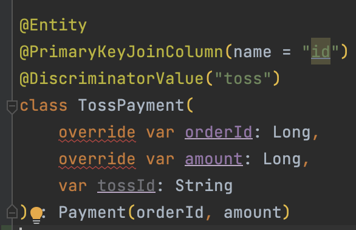

# Kotlin entity all open

## Overview

자바에서 class를 final로 선언하면 상속을 할 수 없다.

코틀린의 모든 클래스와 메소드는 기본적으로 final이다. 그래서 어떤 클래스의 상속을 허용하려면 클래스 앞에 open 변경자를 붙여야 한다. 더불어 오버라이드를 허용하고 싶은 메소드나 프로퍼티 앞에서 open 변경자를 붙여야만 한다.

하지만 일일히 open을 붙이는건 작업량을 매우 증가시킨다.

gradle 설정으로 특정 어노테이션에 대해서 allOpen을 동작 시킬 수 있다.

```kotlin
allOpen {
    annotation("javax.persistence.Entity")
}
```

Entity를 open하고 joined 전략으로 테이블 구조를 만들었다.



하지만 무엇 때문인지 override에서 컴파일 에러가 발생했다.

개발 환경은 Spring Boot 3 버전을 사용했고, 해당 버전부터는 JDK 17이 필수이다.

JDK 17에서는 패키지가 javax에서 jakarta로 변경되었다.

```kotlin
allOpen {
    annotation("jakarta.persistence.Entity")
}
```

## Conclusion

최근 Spring Boot 3 버전을 자주 사용했지만 할 때마다 잊어버리는 것 같다.