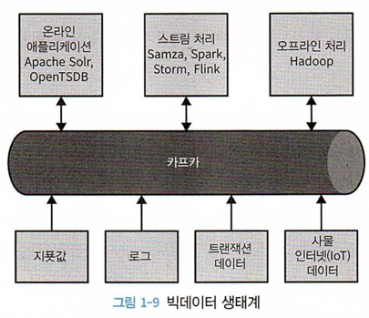

# 1장 카프카 시작하기

## 1.3 왜 카프카인가?

### 1.3.1 다중 프로듀서

카프카는 여러 프로듀서를 처리할 수 있다.

### 1.3.2 다중 컨슈머

카프카는 많은 커슈머가 상호 간섭 없이 어떠한 메시지 스트림도 읽을 수 있다.

다른 큐 시스템은 하나의 메시지를 하나의 클라이언트만 소비할 수 있다.

### 1.3.3 디스크 기반 보존

카프카는 디스크에 메시지를 저장한다. 트래픽 폭주나 지연이 발생해도 데이터 유실 위험이 없다.

### 1.3.4 확장성

카프카는 브로커를 추가로 확장할 수 있다.

처음에는 3개의 브로커로 시작해서 수백 개의 브로커로 확장할 수 있다.

### 1.3.5 고성능

카프카는 높은 부하 상태에서도 높은 성능을 발행/구독 메시지 전달 시스템이다.

발행된 메시지가 컨슈머에게 전달되기까지 1초도 안걸린다.

프로듀서, 컨슈머, 브로커 모두가 매우 큰 메시지 스트림을 처리할 수 있도록 수평적 확장이 가능하다.

## 1.4 데이터 생태계

### 1.4.1 이용 사례

- 메시지 교환
  - 사용자에게 알림을 보내야하는 애플리케이션에서 활용할 수 있다.
- 지표 및 로그 수집
- 커밋 로그
- 스트림 처리
  - 메시지가 생성되자마자 처리해야 하는 경우에 활용할 수 있다.