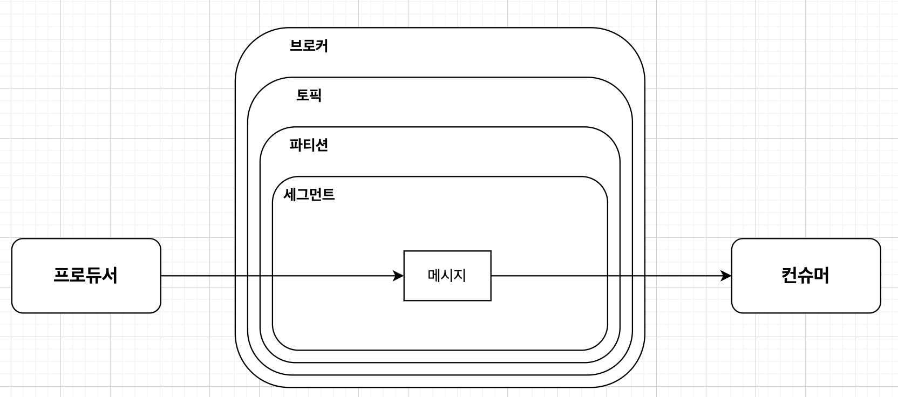

# 3장 카프카 기본 개념과 구조

| 명칭        | 설명                                             |
|-----------|------------------------------------------------|
| 주키퍼       | 카프카의 메타데이터 관리 및 브로커의 정상상태 점검을 담당               |
| 카프카 클러스터  | 여러 대의 브로커를 구성한 클러스터를 의미                        |
| 브로커       | 카프카 애플리케이션이 설치된 서버 또는 노드                       |
| 프로듀서      | 카프카로 메시지를 보내는 역할을 하는 클라이언트                     |
| 컨슈머       | 카프카에서 메시지를 꺼내가는 역할을 하는 클라이언트                   |
| 토픽        | 카프카는 메시지 피드들을 토픽으로 구분하고, 각 토픽의 이름은 카프카 내에서 고유함 |
| 파티션       | 병렬 처리 및 고성능을 얻기 위해 하나의 토픽을 여러 개로 나눈 것          |
| 세그먼트      | 프로듀서가 전송한 실제 메시지가 브로커의 로컬 디스크에 저장되는 파일         |
| 메시지 / 레코드 | 프로듀서가 브로커로 전송하거나 컨슈머가 읽어가는 데이터 조각              |

### 리플리케이션

- 각 메시지들을 여러 개로 복제해서 카프카 클러스터 내 브로커들에 분산시키는 동작
- 토픽의 리플리케이션 팩터 수 3으로 설정하면 토픽은 원본을 포함해 3개가 존재하게 된다.

### 파티션

- 하나의 토픽이 한 번에 처리할 수 있는 한계를 높이기 위해 토픽 하나를 여러 개로 나눠 병렬 처리가 가능하게 만드는 것
- 분산처리 가능
- 나뉜 파티션 수만큼 컨슈머를 연결 가능
- 토픽을 생성할 때 옵션으로 설정
- 적절한 파티션 수를 기준은 다소 모호하다. 메시지 크기, 초당 메시지 건수 등으로 달라짐.
- 생성 후 파티션 수를 늘릴 수 있지만 절대로 줄일 수 없다.

### 세그먼트

- 프로듀서를 이용해 보낸 메시지는 토픽의 파티션에 저장 된다.
- 메시지들은 세그먼트라는 로그 파일의 형태로 브로커의 로컬 디스크에 저장함.

## 카프카의 핵심 개념

### 페이지 캐시

카프카는 높은 처리량 위해 페이지 캐시 기능을 추가했다.

운영체제도 성능을 높이기 위해 페이지 캐시를 활용하는데, 카프카도 OS의 페이지 캐시를 활용한다.

직접 디스크에 I/O 하지 않고 메모리에서 사용되지 않는 잔여 메모리를 활용한다.

### 배치 전송

카프카가 프로듀서 컨슈머와 통신하면서 많은 메시지를 주고 받는데, 단건으로 통신할 수도 있지만 여러건을 묶어 통신할 수도 있다.

### 압축 전송

카프카는 메시지를 압축 전송을 권장한다.

압축하면 네트워크 대역폭, 회선 비용을 줄일 수 있다.

특히 배치 전송을 사용할 때 효과적이다.

### 토픽 파티션 오프셋

